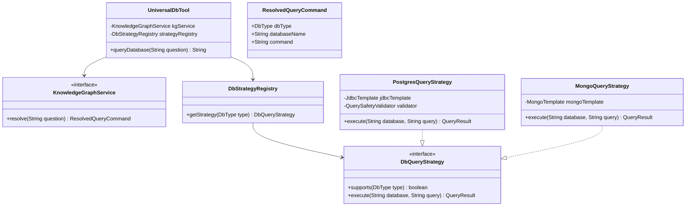
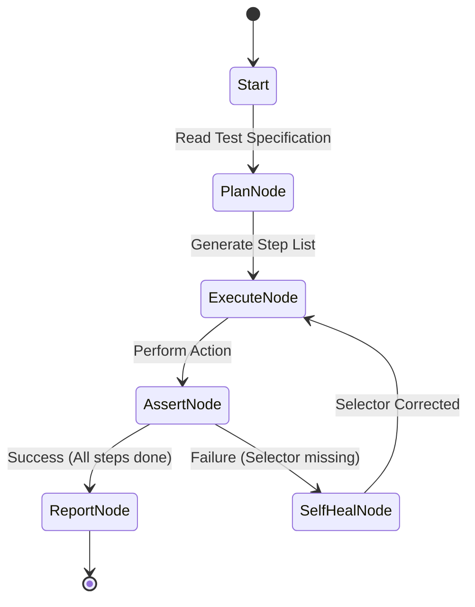

# AM AI Platform — Master Architecture & Technical Design Specification
> **Role:** Technical Architect & Software Developer  
> **Status:** Proposal for Approval | **Target Repositories:** `am-platform`, `am-core-services`, `am-ui-test-agent` (New)

This specification defines the complete technical design, module-level interfaces, class signatures, security validation filters, error mappings, and verification procedures for the AM AI Platform. It serves as the single source of truth for the multi-repository development.

---

## 1. System Topology & Communication Interfaces

The system maintains a clean separation of concerns across three microservices, communicating via standard REST, SSE (Server-Sent Events), and the MCP (Model Context Protocol).

```mermaid
graph TD
    Client[Flutter Web App / API Client] -- HTTP/SSE (Port 8120) --> Gateway[am-mcp-gateway]
    
    subgraph Gateway Observability & Resilience
        Gateway -- Async logging --> Langfuse[Langfuse Tracing :3000]
        Gateway -- Async metrics --> MLflow[MLflow Server :5000]
        Gateway -- Read/Write Cache --> Redis[Redis Server :6379]
    end

    Gateway -- SSE / JSON-RPC --> MCPServer[am-mcp-server :8080]
    
    subgraph Tool Executions (am-mcp-server)
        MCPServer -- Read-Only Query --> Postgres[(PostgreSQL DB :5432)]
        MCPServer -- Read-Only Pipeline --> Mongo[(MongoDB :27017)]
        MCPServer -- Flux Metric Query --> Influx[(InfluxDB :8086)]
        MCPServer -- Read-Only Commands --> RedisDB[(Redis DB :6379)]
        MCPServer -- SDK Call --> OtherServices[Core Portfolio/Trade APIs]
    end

    subgraph Autonomous Testing (am-ui-test-agent :8130)
        TestAgent[LangGraph Agent] -- Playwright --> Client
        TestAgent -- Direct Vision API --> Together[Together AI: Qwen2.5-VL]
        TestAgent -- Context / Element lookup --> Qdrant[(Qdrant Vector Store :6333)]
    end
```

### Protocol & Port Registry
| Component | Port | Interface Protocol | Namespace | Authentication |
|---|---|---|---|---|
| `am-mcp-gateway` | `8120` | HTTP / SSE | `am-apps-preprod` | Keycloak JWT Bearer |
| `am-mcp-server` | `8080` | HTTP / SSE (MCP) | `am-apps-preprod` | Internal static token / m2m |
| `am-ui-test-agent`| `8130` | HTTP / JSON | `am-apps-preprod` | Keycloak JWT Bearer |
| `Langfuse` | `3000` | HTTP / JSON | `am-ai` | Public/Secret API Key |
| `MLflow` | `5000` | HTTP / JSON | `am-ai` | Public Access |
| `Qdrant` | `6333` | HTTP / gRPC | `am-ai` | Optional API Key |

---

## 2. Component A: `am-mcp-gateway` (FastAPI)

Located at [am-platform/am-mcp-gateway/](file:///a:/InfraCode/AM-Portfolio-grp/am-platform/am-mcp-gateway/), this gateway coordinates client connections, handles failover logic, sanitizes tokens, and buffers model telemetry.

### 2.1 Detailed Class & File Specifications

#### 1. Security Module
* **File:** `app/security/jwks_cache.py`
  * **Class:** `JWKSCache`
    * Exposes an asynchronous client to fetch and parse Keycloak public certificates.
    * Uses a local cache with a 5-minute TTL to verify JWT signatures rapidly.
    ```python
    class JWKSCache:
        def __init__(self, jwks_url: str, cache_ttl: int = 300):
            self.jwks_url = jwks_url
            self.cache_ttl = cache_ttl
            self._keys: dict = {}
            self._last_fetched: float = 0.0

        async def get_public_key(self, kid: str) -> dict:
            """Fetches JWKS keys and returns the matching PEM key for 'kid'."""
            pass
    ```
* **File:** `app/security/jwt_bearer.py`
  * **Class:** `JWTBearer` (inherits from FastAPI `HTTPBearer`)
    * Verifies that incoming requests contain a valid Keycloak JWT.
    ```python
    class JWTBearer(HTTPBearer):
        def __init__(self, auto_error: bool = True):
            super().__init__(auto_error=auto_error)

        async def __call__(self, request: Request) -> TokenPayload:
            """Extracts, decodes, and validates claims of the token."""
            pass
    ```

#### 2. LLM Resiliency & Failover Module
* **File:** `app/llm/circuit_breaker.py`
  * **Class:** `CircuitBreaker`
    * Implements circuit breaker pattern for each downstream LLM provider.
    ```python
    class CircuitState(Enum):
        CLOSED = "CLOSED"
        OPEN = "OPEN"
        HALF_OPEN = "HALF_OPEN"

    class CircuitBreaker:
        def __init__(self, provider: str, failure_threshold: int = 5, recovery_timeout: int = 30):
            self.provider = provider
            self.failure_threshold = failure_threshold
            self.recovery_timeout = recovery_timeout
            self.state = CircuitState.CLOSED
            self.failures = 0
            self.last_state_change = time.time()

        def record_success(self):
            self.failures = 0
            self.state = CircuitState.CLOSED

        def record_failure(self):
            self.failures += 1
            if self.failures >= self.failure_threshold:
                self.state = CircuitState.OPEN
                self.last_state_change = time.time()

        def allow_request(self) -> bool:
            """Checks if request is permitted based on circuit state."""
            if self.state == CircuitState.CLOSED:
                return True
            if self.state == CircuitState.OPEN:
                if time.time() - self.last_state_change > self.recovery_timeout:
                    self.state = CircuitState.HALF_OPEN
                    return True
                return False
            return True # HALF_OPEN state allows a single try
    ```
* **File:** `app/llm/router.py`
  * **Class:** `LLMRouter`
    * Resolves active configuration settings and coordinates downstream call retries.
    ```python
    class LLMRouter:
        def __init__(self, fallback_chain: List[str]):
            self.fallback_chain = fallback_chain
            self.breakers = {provider: CircuitBreaker(provider) for provider in fallback_chain}

        async def generate_chat_stream(self, request: ChatRequest) -> AsyncIterator[str]:
            """Loops through the fallback chain and yields streamed text chunks."""
            pass
    ```

#### 3. Redis Response Caching
* **File:** `app/cache/response_cache.py`
  * **Class:** `ResponseCache`
    * Performs deterministic hashing of inputs.
    ```python
    class ResponseCache:
        def __init__(self, redis_url: str, default_ttl: int = 300):
            self.redis_client = redis.from_url(redis_url)
            self.default_ttl = default_ttl

        def build_key(self, user_id: str, prompt: str, model: str) -> str:
            sanitized = prompt.strip().lower()
            h = hashlib.sha256(f"{user_id}:{sanitized}:{model}".encode()).hexdigest()
            return f"mcp:cache:{h}"

        async def get(self, key: str) -> Optional[str]:
            return await self.redis_client.get(key)

        async def set(self, key: str, value: str, ttl: Optional[int] = None):
            await self.redis_client.set(key, value, ex=ttl or self.default_ttl)
    ```

### 2.2 Endpoint Schema Specifications

#### 1. Chat Completion Endpoint
* **Path:** `POST /api/v1/chat`
* **Headers:**
  ```http
  Authorization: Bearer <Keycloak_JWT>
  Content-Type: application/json
  Accept: text/event-stream
  ```
* **Request JSON Schema:**
  ```json
  {
    "type": "object",
    "properties": {
      "message": { "type": "string" },
      "model": { "type": "string", "default": "deepseek-chat" },
      "temperature": { "type": "number", "minimum": 0.0, "maximum": 2.0, "default": 0.2 },
      "stream": { "type": "boolean", "default": true }
    },
    "required": ["message"]
  }
  ```
* **Stream Response Format (SSE):**
  ```http
  data: {"chunk": "token", "model": "deepseek-chat"}
  
  data: {"chunk": " ", "model": "deepseek-chat"}
  
  data: {"chunk": "[DONE]", "model": "deepseek-chat"}
  ```

---

## 3. Component B: `am-mcp-server` (Java Spring Boot)

Located at [services/am-mcp-server](file:///a:/InfraCode/AM-Portfolio-grp/am-core-services/services/am-mcp-server), this server acts as the primary engine for tool execution.

### 3.1 Swapping Transport Type to SSE
We switch the transport settings in [application.yaml](file:///a:/InfraCode/AM-Portfolio-grp/am-core-services/services/am-mcp-server/src/main/resources/application.yaml):
```yaml
spring:
  ai:
    mcp:
      server:
        name: am-platform-mcp
        version: 1.0.0
        transport-type: SSE    # Swapped from STDIO
```
By selecting `SSE`, Spring AI auto-exposes:
* `GET /sse` — Establishes client Server-Sent Events flow.
* `POST /mcp/message` — Endpoint for receiving client JSON-RPC executions.

---

### 3.2 Strategy Pattern & UniversalDbTool Integration with Knowledge Graph

To optimize latency, accuracy, and coupling, we decouple the query generation from raw LLM calls. The system leverages an existing **Knowledge Graph Service** that maps natural language questions semantically to the correct database types, database names, and execution commands. The Spring Boot server acts as the secure executor.



#### 1. Resolved Command DTO & Service Interface
```java
package com.am.mcp.db.model;

import com.am.mcp.db.DbType;

public class ResolvedQueryCommand {
    private DbType dbType;
    private String databaseName;
    private String command;

    public ResolvedQueryCommand(DbType dbType, String databaseName, String command) {
        this.dbType = dbType;
        this.databaseName = databaseName;
        this.command = command;
    }

    public DbType getDbType() { return dbType; }
    public String getDatabaseName() { return databaseName; }
    public String getCommand() { return command; }
}
```

```java
package com.am.mcp.db;

import com.am.mcp.db.model.ResolvedQueryCommand;

public interface KnowledgeGraphService {
    /**
     * Translates a natural language question into database, type, and command
     * using the semantic Knowledge Graph.
     */
    ResolvedQueryCommand resolve(String question);
}
```

#### 2. SQL AST Safety Validator (`QuerySafetyValidator.java`)
Uses `JSqlParser` to build a complete AST representation of the generated query and filters non-SELECT clauses.
```java
package com.am.mcp.db;

import net.sf.jsqlparser.parser.CCJSqlParserUtil;
import net.sf.jsqlparser.statement.Statement;
import net.sf.jsqlparser.statement.select.Select;

public class QuerySafetyValidator {
    
    public static void validatePostgresQuery(String sql) throws SecurityException {
        try {
            Statement stmt = CCJSqlParserUtil.parse(sql);
            if (!(stmt instanceof Select)) {
                throw new SecurityException("Forbidden Statement. Only SELECT queries are permitted.");
            }
            
            String normalized = sql.toLowerCase();
            if (normalized.contains("pg_") || normalized.contains("information_schema")) {
                throw new SecurityException("Catalog Access Forbidden. Reading system tables is blocked.");
            }
        } catch (Exception e) {
            throw new SecurityException("Malformed SQL query: " + e.getMessage());
        }
    }
}
```

#### 3. Redis Lettuce Whitelist Checks (`RedisQueryStrategy.java`)
```java
package com.am.mcp.db.strategies;

import com.am.mcp.db.DbQueryStrategy;
import com.am.mcp.db.DbType;
import com.am.mcp.db.model.QueryResult;
import java.util.Set;

public class RedisQueryStrategy implements DbQueryStrategy {
    private static final Set<String> ALLOWED_COMMANDS = Set.of(
        "GET", "HGET", "KEYS", "LRANGE", "SMEMBERS", "TTL", "SCAN"
    );

    @Override
    public boolean supports(DbType type) {
        return type == DbType.REDIS;
    }

    @Override
    public QueryResult execute(String database, String commandString) throws SecurityException {
        String baseCommand = commandString.trim().split(" ")[0].toUpperCase();
        if (!ALLOWED_COMMANDS.contains(baseCommand)) {
            throw new SecurityException("Command " + baseCommand + " is forbidden on Redis.");
        }
        // Logic for execution via Lettuce Client goes here
        return new QueryResult(commandString, "Redis execution result placeholder");
    }
}
```

---

## 4. Component C: `am-ui-test-agent` (Python + Playwright)

An autonomous testing engine that runs visual and exploratory tests against the Flutter web app.

### 4.1 LangGraph State & Transitions
The testing cycle is implemented as a state machine using LangGraph.



#### State Definition (`state.py`)
```python
from typing import TypedDict, List, Dict, Any

class AgentState(TypedDict):
    target_url: str
    specification: str
    steps: List[str]
    current_step_index: int
    selectors_db: Dict[str, str]
    failures_encountered: List[Dict[str, Any]]
    screenshot_history: List[str]
    report_output: str
```

#### Together AI Qwen2.5-VL Vision Endpoint Call Spec
To detect element offsets from screenshots without local model execution:
* **API Endpoint:** `POST https://api.together.xyz/v1/chat/completions`
* **JSON Payload Spec:**
```json
{
  "model": "Qwen/Qwen2.5-VL-7B-Instruct",
  "messages": [
    {
      "role": "user",
      "content": [
        {
          "type": "text",
          "text": "Identify the bounding box [ymin, xmin, ymax, xmax] normalized to 0-1000 for the button labeled 'Sign In'."
        },
        {
          "type": "image_url",
          "image_url": {
            "url": "data:image/png;base64,iVBORw0KG..."
          }
        }
      ]
    }
  ]
}
```

### 4.2 Qdrant Collection Structures
Coordinates, visual structures, and element attributes are indexed across four collections:

| Collection Name | Key Payload Details | Vector Dimension | Metric Type |
|---|---|---|---|
| `ui_patterns` | `page_route`, `visual_signature` | 512 (CLIP Image Encoder) | Cosine |
| `test_cases` | `spec_text`, `steps_json`, `status` | 1536 (DeepSeek Text) | Cosine |
| `selectors` | `element_role`, `xpath`, `coordinates`| 1536 (DeepSeek Text) | Cosine |
| `bug_memory` | `screenshot_base64`, `stack_trace` | 512 (CLIP Image Encoder) | Cosine |

---

## 5. System Error Mapping & Resiliency Strategy

### Comprehensive Error Handling Mapping
| Scenario | Detection Root Cause | HTTP Status | Response Payload | Recoverability Action |
|---|---|---|---|---|
| DeepSeek Timeout | Client wait > 60 seconds | `504 Gateway Timeout` | `{"error": "Timeout", "retry_after": 5}` | Route next request to Gemini |
| Full Outage | All model APIs return 5xx | `503 Service Unavailable`| `{"error": "Models Unavailable"}` | Offer default canned response from cache |
| Invalid Auth Token | JWKS public key mismatch | `401 Unauthorized` | `{"error": "token_invalid"}` | Clear signature cache, attempt single refetch |
| SQL DML attempt | AST validation failure | `403 Forbidden` | `{"error": "Forbidden query modification"}` | Terminate request, block agent action |
| Mongo aggregations loop | Aggregation pipeline contains `$where` | `403 Forbidden` | `{"error": "Forbidden aggregate operator"}`| Terminate request, block agent action |
| MCP Service Offline | Gateway call connection refused | `200 OK` | `{"response": "Chat logic only (Tools Offline)"}`| Disable tool call routing for 30s |

---

## 6. Phase-Wise Development Checklist

### Phase 1: `am-mcp-gateway` (FastAPI)
- [ ] Implement `app/config.py` loading environments.
- [ ] Implement `app/security/jwks_cache.py` and Keycloak Token verification.
- [ ] Implement `app/llm/circuit_breaker.py` circuit-breaking state logic.
- [ ] Implement `app/llm/router.py` failover sequence.
- [ ] Implement `app/cache/response_cache.py` with Redis caching.
- [ ] Implement `app/observability/langfuse_tracer.py` async callbacks.
- [ ] Implement `app/api/chat_router.py` endpoints.

### Phase 2: `UniversalDbTool` (Spring Boot)
- [ ] Switch `spring.ai.mcp.server.transport-type: SSE` in `application.yaml`.
- [ ] Implement `QuerySafetyValidator.java` with JSqlParser selectors.
- [ ] Implement `PostgresQueryStrategy.java`, `MongoQueryStrategy.java`, `InfluxQueryStrategy.java`, and `RedisQueryStrategy.java`.
- [ ] Implement `DbStrategyRegistry.java` auto-binding.
- [ ] Implement `UniversalDbTool.java` `@Tool` endpoint.

### Phase 3: `am-ui-test-agent` (Playwright)
- [ ] Scaffold `am-ui-test-agent` directories.
- [ ] Implement Playwright Browser lifecycle interface.
- [ ] Setup Together AI API Qwen2.5-VL connector.
- [ ] Bind Qdrant memory collection CRUD tools.
- [ ] Program LangGraph agent sequence workflow.
