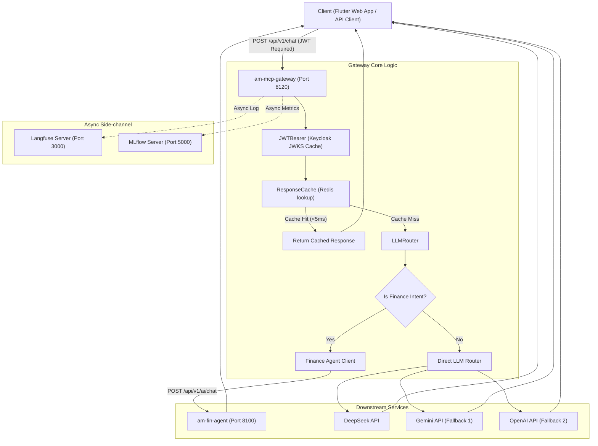

# AM MCP Gateway — Technical Design Specification
> **Role:** Technical Architect & Software Developer  
> **Status:** Finalized Design Specification | **Scope:** `am-platform/am-mcp-gateway/`

This specification defines the complete technical architecture, data flow, classes, signatures, API schemas, and error handling for the `am-mcp-gateway` service. It acts as the single source of truth for development of the intelligent routing layer.

---

## 1. System Context & Topology

The `am-mcp-gateway` acts as the secure entry point for all client chat requests. It handles JSON Web Token (JWT) verification, response caching, intelligent LLM routing, resilience circuit-breaking, and asynchronous observability logging (traces and metrics).



### Protocol & Port Registry
| Component | Port | Interface Protocol | Namespace / Location | Authentication |
|---|---|---|---|---|
| `am-mcp-gateway` | `8120` | HTTP / SSE | `am-apps-preprod` | Keycloak JWT Bearer |
| `am-fin-agent` | `8100` | HTTP / JSON | `am-apps-preprod` | Internal m2m / Gateway Trusted |
| `Langfuse` | `3000` | HTTP / JSON | `am-ai` (Self-hosted) | API Keys |
| `MLflow` | `5000` | HTTP / JSON | `am-ai` (Self-hosted) | Unauthenticated |
| `Redis` | `6379` | TCP | `am-infra` (DB Index 4) | Password Authenticated |

---

## 2. Directory & File Structure

The gateway is located at [am-platform/am-mcp-gateway/](file:///a:/InfraCode/AM-Portfolio-grp/am-platform/am-mcp-gateway/). The component layout is as follows:

```
am-mcp-gateway/
├── requirements.txt           # Production dependencies (includes am-platform-security)
├── requirements-dev.txt       # Development/Test dependencies
├── pyproject.toml             # Python tool configurations
├── Dockerfile                 # Multi-stage production container definition
├── Makefile                   # Local automation tasks
├── helm/
│   ├── values.yaml            # Base deployment configuration & Ingress setup
│   ├── values.preprod.yaml    # Preprod overrides
│   ├── values.prod.yaml       # Production overrides
│   └── vault-mappings.yaml    # HashiCorp Vault secrets schema mapping
├── app/
│   ├── __init__.py
│   ├── main.py                # App initialization, lifespan configuration, and CORS setups
│   ├── config.py              # Pydantic BaseSettings config class definition
│   ├── llm/
│   │   ├── __init__.py
│   │   ├── base.py            # Base abstract classes for LLM provider wrappers
│   │   ├── circuit_breaker.py # Tripping states (CLOSED, OPEN, HALF_OPEN) per LLM provider
│   │   ├── router.py          # Resilient fallback routing logic
│   │   ├── deepseek.py        # DeepSeek API wrapper
│   │   ├── gemini.py          # Gemini API wrapper
│   │   └── openai.py          # OpenAI API wrapper
│   ├── session/
│   │   ├── __init__.py
│   │   └── cache.py           # Redis response cache with TTL hashing
│   ├── tools/
│   │   ├── __init__.py
│   │   └── fin_agent_client.py# Client to proxy requests to am-fin-agent
│   ├── observability/
│   │   ├── __init__.py
│   │   └── tracer.py          # Async non-blocking Langfuse / MLflow callbacks
│   └── api/
│       ├── __init__.py
│       ├── chat.py            # Main chat router exposing chat and stream endpoints
│       └── health.py          # Liveness and readiness endpoints
└── tests/
    ├── conftest.py
    ├── test_llm_router.py
    └── test_cache.py
```

---

## 3. Core Module Specifications

### 3.1 Security Module
We do not re-implement authentication or token signature verification. Instead, the gateway relies on the shared package [am-platform-security](file:///a:/InfraCode/AM-Portfolio-grp/am-platform/libraries/am-platform-security/) to guarantee security consistency.

* **FastAPI Dependency Injection**:
  * The endpoints in [chat.py](file:///a:/InfraCode/AM-Portfolio-grp/am-platform/am-mcp-gateway/app/api/chat.py) inject the verification filter:
    `Depends(require_auth_context(expected_audience=settings.AM_MCP_CLIENT_ID))`
  * This validates Keycloak JWTs, handles OIDC issuer schema discrepancies (`http` vs `https`), and bypasses the WAF certificate fetching block by sending the mandatory `"User-Agent": "am-platform-security/1.0"` request header.


### 3.2 LLM & Failover Router
* **File:** [circuit_breaker.py](file:///a:/InfraCode/AM-Portfolio-grp/am-platform/am-mcp-gateway/app/llm/circuit_breaker.py)
  * **Class:** `CircuitBreaker`
    * Manages state machine (`CLOSED`, `OPEN`, `HALF_OPEN`) per LLM provider to isolate failing third-party APIs.
    * Automatically trips to `OPEN` state after `LLM_CB_FAILURE_THRESHOLD` consecutive exceptions, rejecting requests instantly for `LLM_CB_RECOVERY_TIMEOUT_SECONDS` before testing via `HALF_OPEN`.
* **File:** [router.py](file:///a:/InfraCode/AM-Portfolio-grp/am-platform/am-mcp-gateway/app/llm/router.py)
  * **Class:** `LLMRouter`
    * Resolves client requests by cycling through `LLM_FALLBACK_CHAIN` (e.g. `deepseek`, `gemini`, `openai`).
    * If the primary provider (e.g., DeepSeek) throws a connection or rate-limit error, the router marks a circuit failure, fallbacks to the next provider (Gemini), and streams or returns the result.

```python
class LLMRouter:
    def __init__(self, providers: List[BaseLLMProvider], circuit_breakers: Dict[str, CircuitBreaker]):
        self.providers = providers
        self.breakers = circuit_breakers

    async def execute_chat(self, prompt: str, user_id: str, stream: bool = True) -> AsyncIterator[str]:
        """Iterates over providers and falls back if circuit breaker permits and provider fails."""
        # Routing logic details...
        pass
```

### 3.3 Redis Response Caching
* **File:** `app/session/cache.py`
  * **Class:** `ResponseCache`
    * Computes SHA-256 hashes based on user ID, text prompt, and selected LLM model.
    * Ignores caching for real-time/dynamic phrases containing tokens such as: `now`, `today`, `current price`, `latest stock`.
    * Default TTL of 300 seconds (5 minutes) configured via Redis.

### 3.4 Finance Agent Proxy
* **File:** `app/tools/fin_agent_client.py`
  * **Class:** `FinAgentClient`
    * Proxies messages to the local `am-fin-agent` instance running on port `8100` via [api.py](file:///a:/InfraCode/AM-Portfolio-grp/am-fin-agent/api.py).
    * If a query relates to portfolio metrics, holdings, trades, or ETFs, the client invokes `POST /api/v1/ai/chat` on `am-fin-agent` rather than calling the LLMs directly.
    * Implements structural schema matching:
      * Sends `ChatRequest` (`message`, `userId`, `sessionId`).
      * Receives `AiIntentResponse` (`message`, `widgetId`, `widgetParams`, `sessionId`, `toolsUsed`, `traceId`).

---

## 4. API Endpoint Specifications

### 4.1 Chat Completion (Streaming)
* **Path:** `POST /api/v1/chat`
* **Headers:**
  ```http
  Authorization: Bearer <Keycloak_JWT>
  Content-Type: application/json
  Accept: text/event-stream
  ```
* **Request Body Schema:**
  ```json
  {
    "message": "What is my current portfolio valuation?",
    "model": "deepseek-chat",
    "temperature": 0.2,
    "stream": true,
    "sessionId": "4be704d9-5e92-48e0-ac55-2ff1b83d1c44"
  }
  ```
* **Stream Response Format (Server-Sent Events):**
  ```http
  data: {"chunk": "Based on ", "model": "deepseek-chat"}
  
  data: {"chunk": "your current holdings...", "model": "deepseek-chat"}
  
  data: {"chunk": "[DONE]", "model": "deepseek-chat"}
  ```

### 4.2 Chat Completion (Synchronous)
* **Path:** `POST /api/v1/chat/sync`
* **Headers:**
  ```http
  Authorization: Bearer <Keycloak_JWT>
  Content-Type: application/json
  ```
* **Response Body Schema:**
  ```json
  {
    "message": "Based on your current holdings, your portfolio is valued at $1,240,000.",
    "model": "deepseek-chat",
    "sessionId": "4be704d9-5e92-48e0-ac55-2ff1b83d1c44",
    "traceId": "9d8e578c-ef0c-4fa2-bc89-6fa786bc9e81",
    "cached": false
  }
  ```

---

## 5. System Error Mapping & Resiliency Strategy

| Scenario | Root Cause | HTTP Status | Response Payload | Recoverability Action |
|---|---|---|---|---|
| DeepSeek Outage | Connection timeout / 503 | `504 Gateway Timeout` | `{"error": "Primary model failed. Retrying..."}` | Automatically routes request to Gemini. Trips DeepSeek breaker. |
| All Providers Offline | All fallback LLMs return errors | `503 Service Unavailable` | `{"error": "All LLM services currently unavailable."}` | Serves canned responses or offline greeting from local cache. |
| Expired Keycloak Token | JWT Expired Claim (`exp`) | `401 Unauthorized` | `{"error": "token_expired"}` | Client must refresh Keycloak session. |
| Invalid Signature | Public Key mismatch | `401 Unauthorized` | `{"error": "token_invalid_signature"}` | Force-refreshes the JWKS Cache once. Reject if still invalid. |
| Finance Agent Offline | Connection Refused on :8100 | `200 OK` | `{"message": "I cannot access live portfolio tools right now. (Tools Offline)", "widgetId": "TEXT_RESPONSE"}` | Gracefully downgrades response to LLM-only, alerting the user. |

---

## 6. Helm & HashiCorp Vault Configuration

The `am-mcp-gateway` is deployed using Helm and secures configurations via Vault mappings.

### 6.1 Vault Secret Mappings (`helm/vault-mappings.yaml`)
Dynamic injection of sensitive keys into the gateway's environment variables:
```yaml
vault:
  secretPaths:
    redis:
      mappings:
        REDIS_URL: "REDIS_URL"
    llm-api-keys:
      mappings:
        DEEPSEEK_API_KEY: "DEEPSEEK_API_KEY"
        GOOGLE_API_KEY: "GOOGLE_API_KEY"
        OPENAI_API_KEY: "OPENAI_API_KEY"
    identity-oidc:
      mappings:
        OIDC_JWKS_URL: "OIDC_JWKS_URL"
        OIDC_ISSUER: "OIDC_ISSUER"
        AM_MCP_CLIENT_SECRET: "AM_MCP_CLIENT_SECRET"
    observability:
      mappings:
        LANGFUSE_PUBLIC_KEY: "LANGFUSE_PUBLIC_KEY"
        LANGFUSE_SECRET_KEY: "LANGFUSE_SECRET_KEY"
```

### 6.2 Helm Values & Ingress (`helm/values.yaml`)
Routes traffic through the Traefik Ingress:
```yaml
global:
  vault:
    enabled: true
    role: "am-backend-role"
    authPath: "auth/kubernetes"
    serviceAccountName: "am-backend-sa"

image:
  repository: am-mcp-gateway

replicaCount: 1
port: 8120

service:
  port: 8120

ingress:
  enabled: true
  className: "traefik"
  annotations:
    kubernetes.io/ingress.class: "traefik"
    traefik.ingress.kubernetes.io/router.entrypoints: web,websecure
    traefik.ingress.kubernetes.io/router.middlewares: >-
      am-apps-preprod-global-cors@kubernetescrd,
      am-apps-preprod-strip-prefix-apps@kubernetescrd
  hosts:
    - host: am.asrax.in
      paths:
        - path: /mcp
          pathType: Prefix
```

