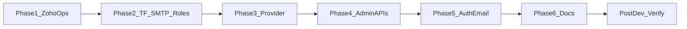
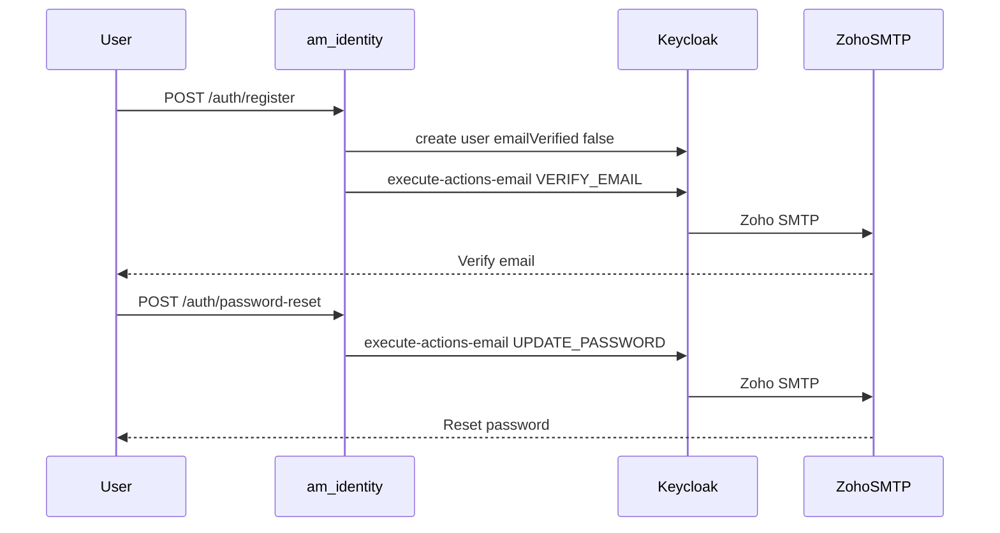

# Feature: Enterprise Identity — Zoho Mail, Admin APIs, Auth Email

| Field | Value |
|-------|--------|
| Branch | `feature/enterprise-identity-zoho-admin` |
| Status | **Phases 2–5 implemented in code; preprod TF SMTP + super_admin applied** — run post-dev verification next |
| Target env | **preprod** first, then prod |
| Owner area | `am-identity` + Keycloak Terraform |
| Zoho From | `noreply@asrax.in` |
| Zoho SMTP | `smtppro.zoho.in:465` SSL (India / paid org) |

## Summary

1. Set up **Zoho Mail SMTP** for Keycloak (company From address).
2. Add **`super_admin`** and wire realm email settings in Terraform.
3. Extend Keycloak provider; ship **`/admin/*`** user/role APIs and **`/auth/*`** verify/reset flows.
4. **Verify after development** (checklist below) before promoting to prod.

**Unchanged:** Google SSO IdP, Novu for product notifications only.

**Important (preprod hotfix):** Do **not** recreate ConfigMap `am-identity-google-login-fix` or mount it over `keycloak_provider.py` / `config.py`. That overlay was a temporary Google-login hotfix; the same Google login code is now in `main` (`authenticate_google_token`, `_ensure_google_user`, `IDENTITY_VERIFY_SSL`). Remounting the old ConfigMap hides newer admin/email methods and breaks `/auth/*`.

**Secrets:** never commit or paste Zoho passwords/tokens into chat or git. Use `.secrets.*.env` / Vault / `am-env-vault` only.

---

## Phase tracker

| Phase | Title | Dev status | Notes |
|-------|--------|------------|-------|
| 1 | Zoho Mail ops + secrets | [x] Done | Local SMTP OK; secrets in `.secrets.preprod.env`; From display **Asrax Accounts** |
| 2 | Terraform SMTP + `super_admin` | [x] Done | Targeted apply on preprod: smtp_server + role + verify_email |
| 3 | Keycloak provider helpers | [x] Done | list/get/roles/execute-actions-email |
| 4 | Admin + user management APIs | [x] Done | `/admin/*` with `require_any_roles` |
| 5 | Auth email APIs | [x] Done | register verify, password-reset, resend-verify |
| 6 | Docs + Postman | [~] Partial | Realm guide + feature doc updated; Postman TBD |
| — | **Post-development verification** | [x] Passed on preprod | E2E `ssd2658@gmail.com`: SMTP realm OK; VERIFY_EMAIL + UPDATE_PASSWORD execute-actions 204; admin/super_admin JWT + `/admin/*`; reject service. Also fixed vault-sync to include `KEYCLOAK_SMTP_*`. Check Gmail inbox/spam for Asrax Accounts mails. |

---

## Phase 1 — Zoho Mail setup (first)

Manual / ops before Terraform or API work.

### Confirmed from Zoho (asrax.in)

| Direction | Host | Port | Mode |
|-----------|------|------|------|
| In (IMAP) | `imappro.zoho.in` | 993 | SSL — not used by Keycloak |
| Out (SMTP) | `smtppro.zoho.in` | **465** | **SSL** — used by Keycloak |
| Mailbox / From | `noreply@asrax.in` | | |

### Development checklist

- [x] Create or pick Zoho mailbox — `noreply@asrax.in`
- [x] Enable SMTP; if 2FA/SAML, create Zoho **Application-specific password**
- [x] Confirm SMTP host — `smtppro.zoho.in:465` SSL
- [ ] DNS: Zoho SPF + DKIM on `asrax.in`
- [ ] Confirm Keycloak pod (`identity/keycloak-0`) can egress to Zoho SMTP
- [x] Write gitignored secrets (e.g. `am-platform/.secrets.preprod.env` + am-env-vault sync)
- [x] Local SMTP test (Python `SMTP_SSL`) — auth + send OK

### Phase 1 exit criteria

- [x] Host/port/user/from chosen and documented for the env
- [x] App password (or SMTP password) stored only in secrets
- [ ] DNS SPF/DKIM ready
- [x] Local SMTP send proved before Keycloak Terraform

---

## Phase 2 — Terraform: Zoho SMTP + `super_admin`

### Role model

| Role | API-assignable | Who may assign |
|------|----------------|----------------|
| `user` | Yes | `admin`, `super_admin` |
| `viewer` | Yes | `admin`, `super_admin` |
| `admin` | Yes | `admin`, `super_admin` |
| `super_admin` | Yes | **`super_admin` only** |
| `service` | Never | Terraform only |

### Development checklist

- [x] Add `smtp_server` on `keycloak_realm` from `KEYCLOAK_SMTP_*` / tfvars
- [x] Set `verify_email = true` on preprod (and later prod)
- [x] Keep `reset_password_allowed = true`
- [x] Add realm role `super_admin`
- [x] Wire variables in `automation/terraform/keycloak/` (`main.tf`, `variables.tf`, tfvars)
- [x] Apply targeted: `smtp_server` + `super_admin` on preprod
- [ ] Bootstrap one `super_admin` in Keycloak UI (one-off) — **manual next step**

### Phase 2 exit criteria

- [x] Terraform applied SMTP + `super_admin` on `am-preprod-realm`
- [ ] Keycloak Admin → Realm → Email → **Test connection** succeeds (manual)
- [ ] Test message arrives with **Asrax Accounts** From (manual)
---

## Phase 3 — Keycloak provider helpers

**Touch:** `am-identity/am_identity/providers/keycloak_provider.py`, `providers/interface.py`

### Development checklist

- [ ] User search / get by id
- [ ] Enable / disable user
- [ ] Realm role list / map / unmap
- [ ] `execute-actions-email` (VERIFY_EMAIL, UPDATE_PASSWORD)

### Phase 3 exit criteria

- [ ] Provider methods callable from services (unit/integration smoke as available)

---

## Phase 4 — Admin + user management APIs

**Touch:** new `api/admin_router.py`, `schemas/admin.py`; mount in `main.py`; `require_any_roles` in `libraries/am-platform-security/.../dependencies.py`

Guard: caller must have **`admin` or `super_admin`**.

### Development checklist

- [ ] `GET /admin/roles`
- [ ] `GET /admin/users` (email/q/first/max)
- [ ] `GET /admin/users/{user_id}`
- [ ] `POST /admin/users` (create + optional verify/update-password mail)
- [ ] `PATCH /admin/users/{user_id}`
- [ ] `POST /admin/users/{user_id}/enabled`
- [ ] `POST /admin/users/{user_id}/send-verify-email`
- [ ] `POST /admin/users/{user_id}/logout`
- [ ] `PUT` / `POST` / `DELETE` role assignment endpoints
- [ ] Rules: reject `service`; only `super_admin` may grant/revoke `super_admin`; never leave zero human roles (fallback `user`); block self-removal of last admin/super_admin

### Phase 4 exit criteria

- [ ] Admin JWT can hit `/admin/*`; non-admin gets 403 in local/preprod smoke

---

## Phase 5 — Public auth email APIs

**Touch:** `am-identity/am_identity/api/auth_router.py`, schemas

### Development checklist

- [ ] `POST /auth/register` → `emailVerified=false` + VERIFY_EMAIL
- [ ] `POST /auth/password-reset` → always **202** (no email enumeration)
- [ ] `POST /auth/password-reset/confirm` (if identity-owned token path)
- [ ] `POST /auth/verify-email/resend`
- [ ] Existing login / refresh / logout / Google SSO unchanged

### Phase 5 exit criteria

- [ ] Register and reset paths return expected status codes against Keycloak with SMTP configured

---

## Phase 6 — Docs (pre-verify)

### Development checklist

- [ ] Update `docs/keycloak-realm-guide.md` (Zoho SMTP + roles)
- [ ] Update Postman collection for `/admin/*` and auth email endpoints
- [ ] Mark this feature doc Phase tracker as development complete (before verify)

---

## Post-development verification (run after Phases 1–6)

Do **not** mark the feature done until this section is complete on **preprod**.

### Mail

- [ ] Keycloak SMTP test email received (company From)
- [ ] Register → Zoho verification email received and link works
- [ ] Forgot password → Zoho reset email → password updated → login works

### Admin / roles

- [ ] Admin JWT lists users and can promote to `admin` / `viewer`
- [ ] Non-admin gets **403** on `/admin/*`
- [ ] Cannot assign `service` via API
- [ ] Non-`super_admin` cannot assign `super_admin`
- [ ] After role change + token refresh, JWT `roles` claim updates

### Regression

- [ ] Existing password login still works
- [ ] Google SSO still works
- [ ] Novu / product notifications unaffected

### Sign-off

| Item | Value |
|------|--------|
| Verified by | |
| Date | |
| Env | preprod |
| Ready for prod? | [ ] Yes / [ ] No — notes: |

---

## Implementation map

| Phase | Touchpoints |
|-------|-------------|
| 1 | Zoho console, DNS, `.secrets.preprod.env`, am-env-vault |
| 2 | `automation/terraform/keycloak/*`, `deploy.ps1 -Env preprod` |
| 3–5 | `keycloak_provider`, `admin_router`, `auth_router`, security `dependencies` |
| 6 | `docs/keycloak-realm-guide.md`, Postman, this feature doc |
| Verify | Preprod Keycloak + identity APIs + inbox |

## Out of scope (later)

- Fine-grained permission matrix / tenant roles / admin UI
- Email OTP / MFA suite
- Zoho org Terraform provider for mailbox IaC
- Replace master `admin-cli` password with identity SA + `realm-management`
