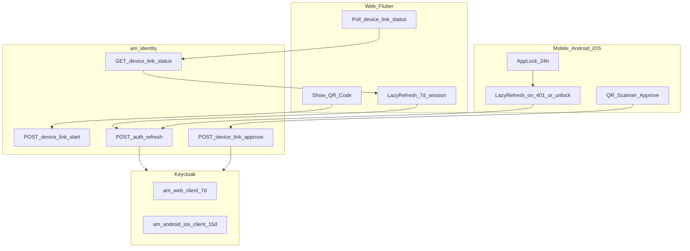
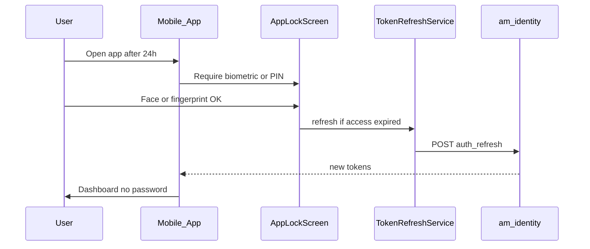
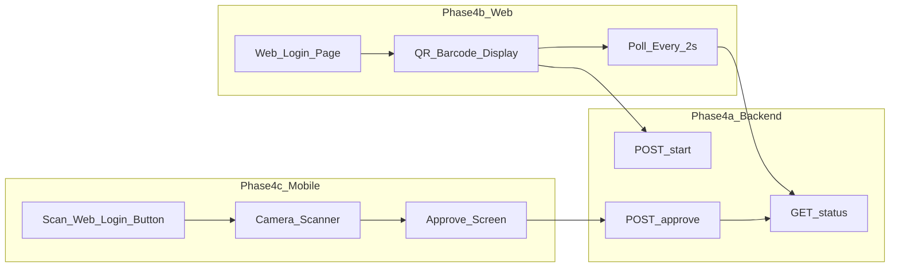
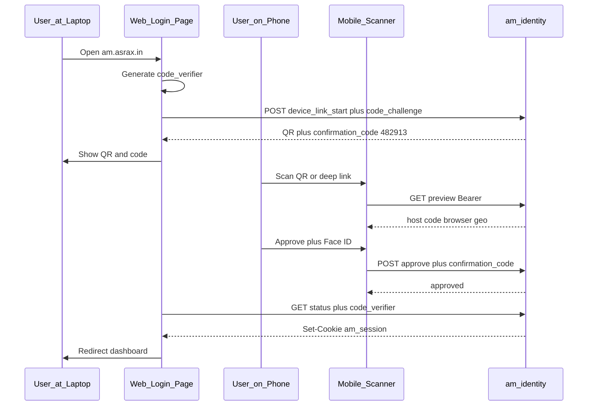
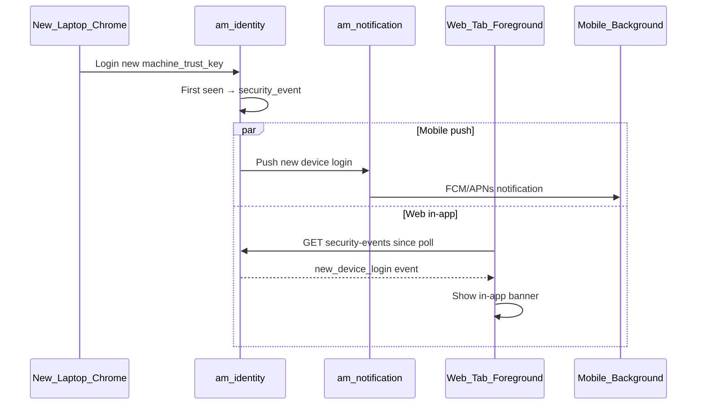
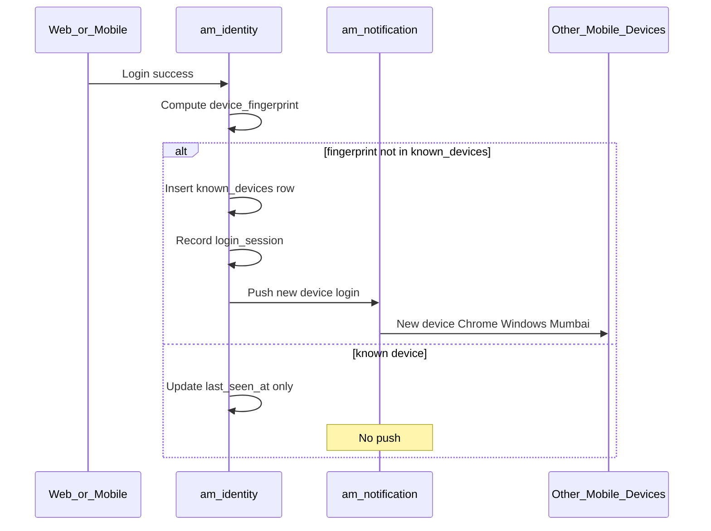
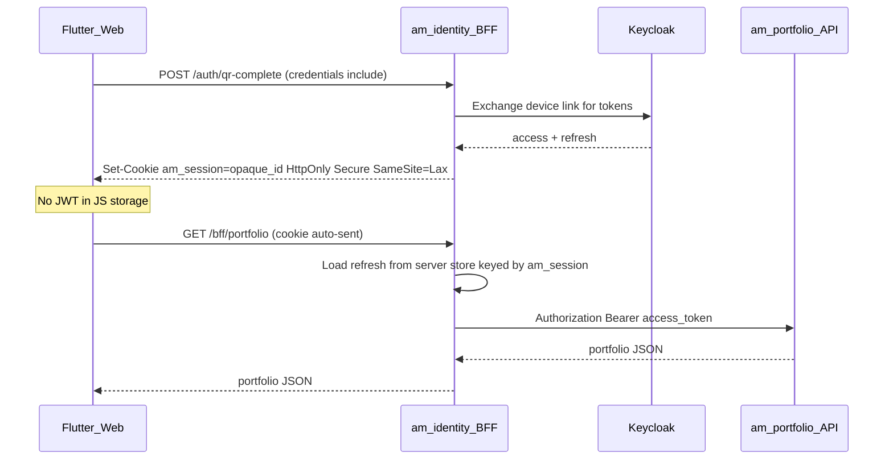

# Identity session, biometric app lock, and QR web login

## Git branches and checkout (before any phase)

Use **one program branch per repo**, both based on **`main`** (never `develop`).

| Repo | Base branch | Working branch | Current state (Sep 2026) |
|------|-------------|----------------|--------------------------|
| [am-platform](a:/InfraCode/AM-Portfolio-grp/am-platform) | **`main`** | **`feature/refresh-token`** | Already checked out; rebase onto `origin/main` before coding |
| [am-modern-ui](a:/InfraCode/AM-Portfolio-grp/am-modern-ui) | **`main`** | **`feature/refresh-token`** | Checked out from `main` (9190e40) |

**Checkout commands (run once at program start):**

```powershell
# --- am-platform ---
cd a:\InfraCode\AM-Portfolio-grp\am-platform
git fetch origin
git checkout feature/refresh-token
git rebase origin/main

# --- am-modern-ui ---
cd a:\InfraCode\AM-Portfolio-grp\am-modern-ui
git fetch origin
git checkout main
git pull origin main
git checkout -b feature/refresh-token
# if branch already exists locally:
# git checkout feature/refresh-token
# git rebase origin/main
```

**Which repo per phase:**

| Phase | am-platform | am-modern-ui |
|-------|-------------|--------------|
| 0 | am-identity Postman, Keycloak audit | Confirm `useIdentityAuth`, interceptor paths |
| 1 | — | am_auth_ui, am_app |
| 2 | automation/terraform Keycloak, am-identity client config | — |
| 3 | — | am_auth_ui mobile, app_router |
| 4a, 4e, 4f (backend) | am-identity auth_router, services, Redis BFF | — |
| 4b, 4c, 4d, 4f (UI) | — | am_auth_ui web + mobile |
| 5, 6 | am-identity sessions APIs, am-notification | Profile UI, SecurityAlertService |
| 7 | both | both |
| 8 | am-identity BFF, step-up API | web BFF client, trade step-up UI |

**PR rule:** Open PRs from `feature/refresh-token` → **`main`** in each repo. Link cross-repo PRs in description.

**Design artifact:** Open [identity-session-auth.drawio](a:/InfraCode/AM-Portfolio-grp/am-platform/docs/design/identity-session-auth.drawio) in [draw.io](https://app.diagrams.net/) for flows (QR, OTP, refresh, alerts, architecture).

---

## Local commit log (feature/refresh-token)

| Phase | Repo | Commit message prefix | Status |
|-------|------|----------------------|--------|
| 0 | am-platform | `docs(identity): phase 0 baseline audit` | pending |
| 1 | am-modern-ui | `feat(auth): phase 1 client refresh core` | pending |
| 2 | am-platform | `feat(identity): phase 2 keycloak session TTL` | pending |
| 3 | am-modern-ui | `feat(auth): phase 3 mobile app lock` | pending |
| 4a | am-platform | `feat(identity): phase 4a device-link backend` | pending |
| 4b | am-modern-ui | `feat(auth): phase 4b web QR login` | pending |
| 4c | am-modern-ui | `feat(auth): phase 4c mobile QR scanner` | pending |
| 4d | both | `docs(auth): phase 4d QR polish` | pending |
| 4e | am-platform | `feat(identity): phase 4e QR hardening BFF` | pending |
| 4f | both | `feat(auth): phase 4f web OTP login` | pending |
| 5 | both | `feat(auth): phase 5 login alerts` | pending |
| 6 | both | `feat(auth): phase 6 active sessions` | pending |
| 7 | both | `docs(auth): phase 7 tests and runbooks` | pending |
| 8 | both | `feat(auth): phase 8 trading hardening` | pending |

Commits are local only (not pushed) until PR review.

---

## Unit test matrix (required per phase)

Every phase ships **with** tests before merge. Mirror paths: `am_auth_ui/test/` ↔ `lib/`, `am-identity/tests/` ↔ `am_identity/`.

### Phase 0 — Baseline (manual + optional smoke)
| Test | Type | Assert |
|------|------|--------|
| Postman refresh after 6m | Manual | 200 + new `access_token` |
| Keycloak client audit doc | Doc | Which client_id in JWT `azp` |

### Phase 1 — Core client refresh (am_auth_ui)
| Test file | Case | Assert |
|-----------|------|--------|
| `test/core/services/token_refresh_service_test.dart` | concurrent refresh calls | single refresh API call (mutex) |
| same | refresh success | storage updated, returns true |
| same | refresh failure | returns false, no duplicate calls |
| same | no refresh token | returns false immediately |
| `test/core/network/auth_interceptor_test.dart` | 401 on API path | refresh + retry with new Bearer |
| same | 401 on `/auth/refresh` | no retry loop |
| same | 401 after retry | passes error through |
| same | non-401 error | unchanged |
| `test/datasources/identity_auth_remote_datasource_test.dart` | logout | POST body contains `refresh_token` |
| same | refreshToken | parses `expires_in`, optional rotated refresh |

### Phase 2 — Keycloak TTL (am-platform)
| Test file | Case | Assert |
|-----------|------|--------|
| `tests/test_keycloak_client_ttl.py` | terraform plan | web 7d / mobile 15d attributes present |
| `tests/test_auth_refresh_rotation.py` | refresh twice | second refresh returns new refresh_token |

### Phase 3 — App lock
| Test file | Case | Assert |
|-----------|------|--------|
| `test/core/services/app_lock_service_test.dart` | &lt;24h since unlock | `requiresUnlock == false` |
| same | &gt;24h | `requiresUnlock == true` |
| same | after unlock | triggers refresh if expired |

### Phase 4a — Device link backend
| Test file | Case | Assert |
|-----------|------|--------|
| `tests/test_device_link_service.py` | start | returns confirmation_code + stores code_challenge |
| same | poll wrong code_verifier | 403 |
| same | approve wrong confirmation_code | 400 |
| same | approve success | status approved, one-time pickup |
| same | expired link | status expired |
| same | deny | audit row + status cancelled |

### Phase 4b/c/e — QR UI + hardening
| Test file | Case | Assert |
|-----------|------|--------|
| `test/features/auth/device_link_poll_service_test.dart` | poll approved | cookie session, no JWT in memory |
| `test/features/auth/qr_confirm_page_test.dart` | preview mismatch host | blocks approve |

### Phase 4f — Web OTP
| Test file | Case | Assert |
|-----------|------|--------|
| `tests/test_web_otp_auth.py` | send rate limit | 429 after threshold |
| same | verify success | Set-Cookie |
| same | mobile User-Agent blocked | 403 |
| `test/features/auth/web_otp_login_test.dart` | verify flow | navigates to dashboard |

### Phase 5 — Login alerts
| Test file | Case | Assert |
|-----------|------|--------|
| `tests/test_login_sessions.py` | new machine_trust_key | push + security_event |
| same | same laptop 2nd browser | no push, new session row |
| `test/core/services/security_alert_service_test.dart` | foreground poll | banner shown |

### Phase 6 — Active sessions
| Test file | Case | Assert |
|-----------|------|--------|
| `tests/test_session_revoke.py` | revoke one | Keycloak session gone, others remain |
| same | sign out everywhere | all sessions revoked |

### Phase 8 — Trading
| Test file | Case | Assert |
|-----------|------|--------|
| `tests/test_step_up_auth.py` | order without step-up | 403 |
| same | with valid step-up token | 200 |
| `test/core/services/token_refresh_service_test.dart` | aggressive mode | refreshes before expiry |

---

## Phase-wise execution plan (todos)

### Phase 0 — Baseline validation
**Branch:** both on `feature/refresh-token` · **No code required unless audit fails**

- [ ] Postman: login → wait 6m → `POST /identity/auth/refresh` → 200
- [ ] Document Keycloak session fields (admin console vs token claims)
- [ ] Audit which client issues tokens (`identity_client_id` vs `am-web-client` / mobile clients)
- [ ] Verify Keycloak Admin API session revoke maps 1:1 to `login_sessions`
- [ ] Confirm Flutter `useIdentityAuth = true` and refresh URL path

### Phase 1 — Core client refresh
**Repo:** am-modern-ui · **Files:** `auth_interceptor.dart`, new `token_refresh_service.dart`, `identity_auth_remote_datasource.dart`

- [ ] `TokenRefreshService` with mutex + `refresh_expires_in` persistence
- [ ] `AuthInterceptor`: 401 → refresh once → retry
- [ ] Logout POST body includes `refresh_token`
- [ ] `FeatureFlags.aggressiveTokenRefresh = false`
- [ ] Unit tests: interceptor, mutex, refresh failure → logout

### Phase 2 — Keycloak TTL
**Repo:** am-platform · **Files:** `automation/terraform/modules/keycloak/main.tf`, am-identity settings

- [ ] Web client 7d session override (`am-web-client`)
- [ ] Mobile clients 15d override (`am-android-client`, `am-ios-client`)
- [ ] Refresh token rotation enabled
- [ ] Login paths issue tokens under platform clients (not only `am-identity-service`)
- [ ] Update `docs/keycloak-realm-guide.md`

### Phase 3 — Mobile app lock (24h)
**Repo:** am-modern-ui · **Files:** new `app_lock_service.dart`, `app_router.dart`, `local_auth`

- [ ] `last_app_unlock_at` in secure storage
- [ ] `/app-lock` route before protected routes (mobile only)
- [ ] Unlock → refresh if access expired
- [ ] No lock on background return within 24h

### Phase 4a — Device-link backend
**Repo:** am-platform/am-identity

- [ ] `device_link_service.py`, schemas, Redis TTL 120s
- [ ] `POST start` with `code_challenge`, `browser`, `os`
- [ ] `GET status` with `code_verifier` → pending/approved/expired
- [ ] `GET preview` (Bearer mobile)
- [ ] `POST approve` with `confirmation_code`, `machine_label`
- [ ] `POST deny`, audit log
- [ ] Postman collection updated

### Phase 4b — Web QR UI
**Repo:** am-modern-ui · **Files:** `login_page.dart` (web), QR poll service

- [ ] Generate `code_verifier` in `sessionStorage`
- [ ] Display QR + 6-digit confirmation code
- [ ] Poll with `credentials: include`
- [ ] Redirect on cookie session

### Phase 4c — Mobile scanner
**Repo:** am-modern-ui

- [ ] Profile entry "Scan to log in on web"
- [ ] Camera + deep link handler
- [ ] Confirm screen from `preview` API
- [ ] Biometric required on approve

### Phase 4e — QR hardening
**Repos:** both

- [ ] Poll returns `Set-Cookie: am_session` only (no JWT in JSON)
- [ ] BFF `/identity/bff/me` for web session
- [ ] Geo mismatch log/warn
- [ ] App Links / Universal Links config

### Phase 4f — Web email/SMS OTP
**Repos:** both

- [ ] `POST /auth/web/otp/send` and `/verify`
- [ ] Block mobile clients from OTP endpoints
- [ ] Web OTP UI on login page
- [ ] Cookie session on verify (same BFF as QR)
- [ ] Rate limits + SMS DLT prep (if SMS enabled)

### Phase 4d — Polish and docs
**Repos:** both

- [ ] Feature flags: `enableQrWebLogin`, `enableWebOtp`
- [ ] `docs/DEVICE_LINK_WEB_LOGIN.md`, `docs/WEB_OTP_LOGIN.md`
- [ ] E2E runbook

### Phase 5 — Login alerts
**Repos:** both

- [ ] `known_devices`, `login_sessions`, `security_events` tables/APIs
- [ ] `machine_trust_key` for web push dedupe
- [ ] FCM/APNs push on new physical device
- [ ] Web `SecurityAlertService` poll when tab visible
- [ ] Mobile notification detail screen

### Phase 6 — Active sessions
**Repos:** both

- [ ] Profile → Security → sessions list (browser, geo, time)
- [ ] Revoke single session
- [ ] Sign out everywhere (bulk revoke)

### Phase 7 — Tests and rollout
**Repos:** both

- [ ] Regression tests (see Phase 7 test table)
- [ ] Preprod rollout order: 1 → 2 → 3 → 4 → 5 → 6
- [ ] Prod sign-off checklist

### Phase 8 — Trading hardening (when buy/sell ships)
**Repos:** both

- [ ] `aggressiveTokenRefresh = true`
- [ ] Step-up auth API + trade gate
- [ ] Full web BFF for portfolio/trade APIs + CSRF

---

## Product policy (locked in)

No buy/sell flows yet, so auth policy stays simpler: no trade step-up. Focus on stay-logged-in UX + periodic re-proof on mobile + passwordless web via phone.

| Surface | Refresh / SSO session | App access gate | Primary login | OTP |
|---------|----------------------|-----------------|---------------|-----|
| **Web** | **7 days** | None | **1. QR scan** from logged-in mobile · **2. Email/SMS OTP** fallback | **Email or SMS OTP — web only** |
| **Mobile (Android/iOS)** | **15 days** | **Face / fingerprint / PIN every 24h** | Google or email/password | **No OTP on mobile** |
| **Access token (all)** | **5 min** (Keycloak) | Refresh **on demand only** until buy/sell (Phase 1C) | — | — |

**OTP policy (locked):**

| Channel | Web | Mobile |
|---------|-----|--------|
| Email OTP | **Yes** — fallback login + optional step-up later | **No** |
| SMS OTP | **Yes** — fallback login | **No** |
| QR scan | **Yes** — primary passwordless | Approve only (scanner) |

Mobile login stays **Google + email/password only**. No SMS/email OTP sent to mobile app login screen.

**Biometric does not replace OAuth.** It unlocks the app locally, then the app may call `POST /identity/auth/refresh` if access token expired.

**QR login does not put refresh tokens in the QR.** QR holds a short-lived opaque `device_link_id` only.

---

## Architecture overview



---

## Current state vs target

### Today

| Item | Current |
|------|---------|
| Keycloak SSO idle / max | **30m / 10h** (realm-wide) — [main.tf](a:/InfraCode/AM-Portfolio-grp/am-platform/automation/terraform/modules/keycloak/main.tf) |
| Client refresh on active use | **Missing** — [auth_interceptor.dart](a:/InfraCode/AM-Portfolio-grp/am-modern-ui/am_auth_ui/lib/core/network/auth_interceptor.dart) no-op on 401 |
| Biometric app lock | **Not implemented** — no `local_auth` in repo |
| QR web login | **Not implemented** — no am-identity endpoints |
| Logout revoke | **Broken on client** — empty POST body |

### Target

| Item | Target |
|------|--------|
| Web refresh session | **7 days** via `am-web-client` client session overrides |
| Mobile refresh session | **15 days** via `am-android-client` / `am-ios-client` overrides |
| Mobile app lock | **Every 24h** since last successful biometric/PIN (or every cold start after 24h) |
| Web login | **QR** (primary) + **email/SMS OTP** (fallback); no Gmail/password on web primary path |
| Mobile login | Google + email/password; **no OTP** |
| Access token | **5m** Keycloak; **lazy client refresh** (no background timer until trading) |
| Refresh rotation | **Enabled** (OAuth 2.1) |

---

## Phase 0 — Validate baseline (before coding)

1. Postman: login → wait 6m → refresh → confirm 200 ([AM-Identity.postman_collection.json](a:/InfraCode/AM-Portfolio-grp/am-platform/am-identity/postman/AM-Identity.postman_collection.json))
2. Record Keycloak admin session fields for a test user
3. Confirm Flutter uses `useIdentityAuth = true` and `/identity/auth/refresh`
4. **Keycloak client audit (Gap #2):** Document which client issues tokens today — [keycloak_provider.py](a:/InfraCode/AM-Portfolio-grp/am-platform/am-identity/am_identity/providers/keycloak_provider.py) uses `identity_client_id` for password/refresh/Google-via-BFF and `web_client_id` for some web flows. Phase 2 TTL on `am-android-client` / `am-ios-client` / `am-web-client` **only applies** if login/device-link issues tokens under those clients. **Action:** extend am-identity to issue mobile tokens via platform client, web QR tokens via `am-web-client`, keep `am-identity-service` for service-account only.

---

## Phase 1 — Core client refresh (am-modern-ui)

**Branch:** `feature/refresh-token` (rebase onto `main` before PR)

### 1A. `TokenRefreshService`

- Single mutex-guarded refresh path
- Persist `access_expires_at` + `refresh_expires_at` from `expires_in` / `refresh_expires_in`
- On success: update storage + `UserContext.populate()`
- On refresh 401/403: clear auth → login / QR screen on web, login / app lock on mobile

### 1B. `AuthInterceptor`

Update [auth_interceptor.dart](a:/InfraCode/AM-Portfolio-grp/am-modern-ui/am_auth_ui/lib/core/network/auth_interceptor.dart):

- 401 → refresh once → retry request
- Exclude `/auth/*` and `/device-link/*` from retry loop

### 1C. Access token refresh — **lazy mode** (until buy/sell exists)

No buy/sell yet → **do not** run proactive refresh timers or refresh while app is idle/background.

| When to refresh access token | Do it? |
|------------------------------|--------|
| Proactive timer every ~4 min while app open | **No** (enable later when trading ships) |
| App sitting in background (other app foreground) | **No** |
| User returns from background within 24h | **No** refresh unless an API call needs it |
| User makes API call and access token expired | **Yes** — 401 interceptor → refresh → retry |
| App lock unlock after 24h | **Yes** — one refresh before dashboard |
| App cold start / splash `checkAuthStatus` | **Yes** — if access expired |
| Web tab refocus (`visibilitychange`) | **No** until trading; 401 path only |

**Feature flag:** `FeatureFlags.aggressiveTokenRefresh = false` (default until buy/sell). When trading launches, flip to `true` to enable proactive timer + foreground refresh.

Web and mobile both use lazy mode for v1.

### 1D. Logout fix

Update [identity_auth_remote_datasource.dart](a:/InfraCode/AM-Portfolio-grp/am-modern-ui/am_auth_ui/lib/features/authentication/data/datasources/identity_auth_remote_datasource.dart):

```dart
await _dio.post(url, data: {'refresh_token': refreshToken});
```

### 1E. Tests

- Interceptor retry, mutex, refresh failure → logout

---

## Phase 2 — Keycloak session TTL (am-platform)

**Goal:** Different refresh session length per client without changing access token TTL.

### Realm baseline (unchanged access token)

```hcl
access_token_lifespan = "5m"
```

### Per-client session overrides (Terraform)

Apply to [main.tf](a:/InfraCode/AM-Portfolio-grp/am-platform/automation/terraform/modules/keycloak/main.tf):

**Web — `am-web-client`**

```hcl
client_session_idle_timeout = "168h"   # 7 days
client_session_max_lifespan = "168h"   # 7 days cap
```

**Mobile — `am-android-client`, `am-ios-client`**

```hcl
client_session_idle_timeout = "360h"   # 15 days
client_session_max_lifespan = "360h"   # 15 days cap
```

Note: Verify exact attribute names on `keycloak_openid_client` provider (may be `client_session_idle_timeout` / `client_session_max_lifespan`). If provider lacks per-client TTL, use Keycloak client advanced settings via `attributes` map or split realm policy documented in [keycloak-realm-guide.md](a:/InfraCode/AM-Portfolio-grp/am-platform/docs/keycloak-realm-guide.md).

### Refresh token rotation

- Enable `revoke_refresh_token = true` at realm level
- Clients already save new `refresh_token` on refresh response — verify after enable in preprod

### am-identity passthrough

No new refresh endpoint needed. Ensure login/refresh responses forward `refresh_expires_in` ([auth.py](a:/InfraCode/AM-Portfolio-grp/am-platform/am-identity/am_identity/schemas/auth.py)).

### Apply order

dev Keycloak → preprod → prod (Terraform apply per env)

---

## Phase 3 — Mobile app lock (biometric / PIN every 24h)

**Scope:** Android + iOS only (`kIsWeb` skip). Web uses QR login instead.

### Dependencies

- Add `local_auth` to [am_auth_ui/pubspec.yaml](a:/InfraCode/AM-Portfolio-grp/am-modern-ui/am_auth_ui/pubspec.yaml)
- Android: `USE_BIOMETRIC` permission; iOS: `NSFaceIDUsageDescription`

### `AppLockService`

Store locally (secure storage):

- `last_app_unlock_at` — ISO timestamp of last successful biometric/PIN

Policy (**24h only — no background app lock**):

- Show **AppLockScreen** only if `now - last_app_unlock_at >= 24h` OR first open after install
- **Do NOT** show app lock when user switches to another app and returns after 5 min, 1 hour, or same day — background time is **ignored** until 24h rule hits
- Supported: face, fingerprint, device PIN (via `local_auth` + platform PIN fallback)
- On success: set `last_app_unlock_at = now` → run `checkAuthStatus()` + **one** `TokenRefreshService.refresh()` → navigate to shell
- On biometric fail 3x: offer full login (Google / password)
- If refresh token expired (>15d idle): full login regardless of biometric

### Background / foreground behavior (mobile)

| User action | App lock? | Token refresh? |
|-------------|-----------|----------------|
| Switch to WhatsApp, back in 2 min | **No** | **No** (unless API call triggers 401 path) |
| Background 1 hour, same day (< 24h since unlock) | **No** | **No** |
| Background overnight, > 24h since last unlock | **Yes** | **Yes** once after unlock |
| Background 3 days, refresh session still valid | **Yes** (24h rule) | **Yes** once after unlock |
| Background 16 days | Full login | N/A |

On `AppLifecycleState.paused`: record `backgrounded_at` for analytics only — **does not trigger lock or refresh**.

On `AppLifecycleState.resumed`: if `< 24h` since `last_app_unlock_at` → go straight to last screen; **no** automatic refresh call.

### UX flow



### Optional hardening (phase 3b)

- Store refresh token in biometric-protected Keychain/Keystore (read only after biometric)
- Not required for v1 if app lock gate is sufficient

### Router integration

- [app_router.dart](a:/InfraCode/AM-Portfolio-grp/am-modern-ui/am_app/lib/core/router/app_router.dart): insert `/app-lock` before protected routes on mobile
- **Removed:** 5-minute background app lock — **24h rule only**

---

## Phase 4 — QR web login (passwordless web via mobile scan)

**What the user does (plain English):**

1. On **laptop/browser**: open `am.asrax.in` → login page shows a **QR / barcode**
2. On **phone**: open AM app (already logged in) → tap **"Scan to log in on web"** → camera opens → point at the QR on the laptop screen
3. Phone shows **confirm screen** ("Log in to am.asrax.in?") → user taps **Approve** → **biometric/PIN required** (Phase 3 gate)
4. **Web browser** automatically logs in — no password, no Gmail on web

Phone is the trust anchor. User must already be logged in on mobile to approve web login.

---

### Phase 4 overview (sub-phases)

| Sub-phase | Who builds | Deliverable |
|-----------|------------|-------------|
| **4a** Backend | am-platform / am-identity | APIs + Redis session store |
| **4b** Web UI | am-modern-ui (web only) | Login page with QR + polling |
| **4c** Mobile scanner | am-modern-ui (Android/iOS only) | Entry points + camera + confirm |
| **4d** Polish | both | Errors, expiry, feature flag, QA |
| **4e** QR hardening | both | PKCE, confirmation code, cookie BFF, audit, deep links |
| **4f** Web OTP | both | Email/SMS OTP login — **web only** |



---

### Phase 4a — Backend (am-identity)

**Repo:** [am-platform/am-identity](a:/InfraCode/AM-Portfolio-grp/am-platform/am-identity)

**Storage:** Redis key `device_link:{id}` TTL **120 seconds**

**QR payload format (encoded in barcode):**

```json
{
  "v": 1,
  "type": "am_device_link",
  "id": "<uuid>",
  "host": "am.asrax.in"
}
```

Also encode as URL for camera apps: `https://am.asrax.in/identity/auth/device-link/scan?id=<uuid>`

Never put tokens in QR.

| Endpoint | Auth | Request | Response |
|----------|------|---------|----------|
| `POST /auth/device-link/start` | None (web) | `{ "client": "web", "redirect_hint": "am.asrax.in", "code_challenge": "<S256 hash>", "browser": "Chrome", "os": "Windows" }` | `{ device_link_id, qr_payload, confirmation_code, expires_at, poll_interval_ms: 2000 }` |
| `GET /auth/device-link/{id}/status` | None (web poll) | `?code_verifier=<secret>` | `{ status, user?: {...} }` — on approved: **`Set-Cookie: am_session=...`** (no JWT in body) |
| `GET /auth/device-link/{id}/preview` | **Bearer mobile** | — | `{ host, confirmation_code, browser, os, geo_city, geo_country, ip_masked, is_new_device, requested_at }` |
| `POST /auth/device-link/{id}/approve` | **Bearer mobile** | `{ "device_name": "Pixel 8", "confirmation_code": "482913", "machine_label": "Office laptop" }` | `{ status: approved }` |
| `POST /auth/device-link/{id}/cancel` | Web or mobile | — | 204 |
| `POST /auth/device-link/{id}/deny` | Bearer mobile | `{ "reason": "not_me" }` | 204 — logs audit + optional security_event |

**PKCE browser binding:** Web generates random `code_verifier` at start; sends `code_challenge = BASE64URL(SHA256(verifier))`. Redis stores challenge. Poll **requires** matching `code_verifier` or returns 403. Prevents third party from stealing poll with leaked `device_link_id`.

**Numeric confirmation code:** Server generates 6-digit `confirmation_code` at start. Web displays `482 913` large under QR. Mobile **must** enter or confirm matching code from `preview` API (server source, not QR). Reject approve if mismatch.

**On approve:**

1. Validate mobile Bearer token → get `user_id`
2. Validate `confirmation_code` matches Redis
3. Reject if device_link expired or already used
4. Optional: warn/block if mobile geo vs web start geo > 500 km within 15 min (configurable, log always)
5. Issue **web** tokens via Keycloak (`am-web-client`, 7d session)
6. Store session in Redis keyed by opaque `am_session` id; poll with valid `code_verifier` returns **`Set-Cookie`** only
7. Delete / mark consumed after successful cookie handoff

**Audit log (Redis or DB):** `device_link_audit`: `{ id, event: started|scanned|previewed|approved|denied|expired|poll_success, ip, user_agent, user_id?, at }`

**Rate limits:** start 10/min/IP; approve 5/min/user; status 30/min/IP

**Files to add:**

- `am_identity/services/device_link_service.py`
- `am_identity/schemas/device_link.py`
- Routes in [auth_router.py](a:/InfraCode/AM-Portfolio-grp/am-platform/am-identity/am_identity/api/auth_router.py)

**Exit criteria:** Postman flow — start → approve with mobile token → poll returns web tokens

---

### Phase 4b — Web UI (Flutter web login page)

**Scope:** `kIsWeb` only. Mobile never shows the QR login page as primary login.

**Screen: Web Login Page** (redesign [login_page.dart](a:/InfraCode/AM-Portfolio-grp/am-modern-ui/am_auth_ui/lib/features/authentication/presentation/pages/login_page.dart))

```
┌─────────────────────────────────────────┐
│           AM Investment Portal          │
│                                         │
│     ┌─────────────────────┐             │
│     │                     │             │
│     │    [ QR BARCODE ]   │  ← large    │
│     │                     │             │
│     └─────────────────────┘             │
│                                         │
│  1. Open AM app on your phone           │
│  2. Tap "Scan to log in on web"         │
│  3. Point camera at this code           │
│                                         │
│  ○ Waiting for scan...  (spinner)       │
│     Refreshes in 1:42                   │
│                                         │
│     Confirm this code on your phone:    │
│           4 8 2   9 1 3                 │  ← server confirmation_code
│                                         │
│  [ Sign in with email or SMS instead ]  │  ← Phase 4f OTP fallback
└─────────────────────────────────────────┘
```

**Behavior:**

1. On page load → generate `code_verifier` (store in `sessionStorage`, tab-scoped) → `POST /auth/device-link/start` with `code_challenge`
2. Render QR from `qr_payload` using `qr_flutter`
3. Display `confirmation_code` from server (large, grouped digits)
4. Poll every 2s → `GET /auth/device-link/{id}/status?code_verifier=...` with `credentials: include`
5. When `status == approved` → cookie `am_session` set by response → `AuthCubit` loads user via `GET /bff/me` → redirect dashboard
6. When QR expires (2 min) → new start (new verifier + new confirmation code)
7. On unmount → `cancel` pending session

**QR auto-rotation rule (explicit):**

| Event | QR changes? |
|-------|-------------|
| Every **2 seconds** (poll) | **No** — same QR while waiting for scan |
| After **2 minutes** (TTL expired) | **Yes** — web calls `start` again, new `device_link_id`, new barcode |
| User refreshes browser | **Yes** — new session |
| After successful scan + login | **Yes** — login page not shown until next visit |

So: **not** a new QR every 2 seconds; **yes** a new QR every **2 minutes** if nobody scanned, plus on page reload.

**States:**

| UI state | When |
|----------|------|
| `waitingForScan` | Default; spinner + countdown |
| `approved` | Brief success → redirect |
| `expired` | Auto-refresh QR silently |
| `error` | Retry button |

**Feature flag:** `FeatureFlags.enableQrWebLogin` (default `true` on web preprod)

**Exit criteria:** Open web in browser → scan with phone (Phase 4c) → web lands on dashboard without password

---

### Phase 4c — Mobile scanner (Android / iOS)

**Scope:** `!kIsWeb` only. User must be **already logged in** on mobile.

#### Where user finds "Scan to log in on web"

Three entry points (all route to same scanner screen):

| Entry point | Location | Label |
|-------------|----------|-------|
| **Primary** | Profile / Account screen | **"Scan to log in on web"** row with QR icon |
| **Secondary** | App shell overflow menu (3-dot) | Same label |
| **Optional** | After mobile login success banner | "Need web? Scan from Profile" one-time hint |

Do **not** hide scanner only in deep settings — it must be obvious like WhatsApp Web / LinkedIn.

#### Screen flow (3 screens)

**Screen 1 — `ScanWebLoginPage` (camera)**

```
┌─────────────────────────┐
│  ← Back    Scan Web Login│
│                         │
│  ┌───────────────────┐  │
│  │   camera viewfinder │  │
│  │   [ scan frame ]    │  │
│  └───────────────────┘  │
│                         │
│  Point at the QR code   │
│  on your computer screen│
└─────────────────────────┘
```

- Package: `mobile_scanner` (camera) or `qr_code_scanner`
- Parse QR JSON or URL → extract `device_link_id`
- Validate `type == am_device_link`
- **Deep link:** `https://am.asrax.in/identity/auth/device-link/scan?id=<uuid>` opens app via Android App Links / iOS Universal Links → lands on confirm screen (skip camera if id valid)
- Invalid QR → toast "Not an AM login code"

**Screen 2 — `ScanWebLoginConfirmPage`**

```
┌─────────────────────────┐
│     Confirm web login   │
│                         │
│  🖥  am.asrax.in         │  ← from server preview, not QR alone
│                         │
│  Code: 482 913          │  ← must match web screen
│                         │
│  Chrome · Windows 11    │  ← server User-Agent at start
│  Mumbai, IN             │  ← server IP geo at start
│  First time this device │  ← if is_new_device
│                         │
│  signed in as           │
│  user@email.com         │
│                         │
│  Label: [ Office laptop ] optional
│                         │
│  [ Not me ]  [ Approve ]│
└─────────────────────────┘
```

- On scan → `GET /device-link/{id}/preview` (Bearer) — **all display fields from server**
- Validate QR `host` matches preview `host` (reject if mismatch = phishing)
- **Approve** → require biometric + submit `confirmation_code` + optional `machine_label`
- **Not me** → `POST /deny` + audit log + optional security_event to other devices

**Screen 3 — Success toast → back to previous screen**

```
✓ Web login approved
```

Mobile user stays on phone; web browser completes on its own via poll.

**API call on Approve:**

```http
POST /identity/auth/device-link/{id}/approve
Authorization: Bearer <mobile_access_token>
{ "device_name": "<phone model>" }
```

**QR chicken-and-egg (Gap #3):** Web-only new users use **Phase 4f email/SMS OTP** (not mobile OTP). QR remains primary once mobile app is installed.

**If mobile not logged in:** entry points hidden or show "Log in on mobile first"

**Router:** add route `/scan-web-login` under authenticated shell ([app_router.dart](a:/InfraCode/AM-Portfolio-grp/am-modern-ui/am_app/lib/core/router/app_router.dart))

**Exit criteria:** Logged-in mobile user scans laptop QR → confirms → web session active

---

### Phase 4d — Polish and hardening

| Item | Detail |
|------|--------|
| Expired QR on web | Countdown + auto-refresh; mobile sees "Code expired" if scanned late |
| Already approved | Web poll once; mobile cannot approve twice |
| Wrong user | N/A — mobile approves as logged-in user only |
| Network errors | Web: "Connection lost, retry"; Mobile: retry approve |
| Feature flag | `enableQrWebLogin` off → web falls back to email login |
| Analytics | `device_link_started`, `device_link_approved`, `device_link_web_success` (no PII) |
| E2E runbook | Document in `docs/DEVICE_LINK_WEB_LOGIN.md` |

---

### Phase 4e — QR hardening (9+/10)

| Item | Detail |
|------|--------|
| Cookie BFF on QR complete | Poll returns `Set-Cookie: am_session` — **no JWT in JSON** (same store as Phase 8C) |
| PKCE `code_verifier` | Only browser that called `start` can poll successfully |
| Numeric `confirmation_code` | Server-generated; shown on web + validated on mobile approve |
| Server `preview` API | Mobile confirm shows geo, browser, OS from server — not QR payload alone |
| Geo mismatch | Log always; optional block/warn if mobile vs web IP > 500 km in 15 min |
| `deny` + audit | "Not me" flow + `device_link_audit` table |
| `machine_label` | Optional nickname at approve ("Office laptop") → shown in Phase 6 sessions |
| Deep links | App Links / Universal Links for QR URL → confirm screen |

**Exit criteria:** Phishing test — fake QR with wrong host rejected at preview; leaked `device_link_id` cannot complete without `code_verifier`; DevTools shows no access token in localStorage after QR login.

---

### Phase 4f — Web email/SMS OTP login (web only)

**Scope:** `kIsWeb` only. **Not exposed on mobile login screens.**

**User flow:**

```
Web login page → [ Sign in with email or SMS instead ]
  → Enter email OR phone number
  → Choose delivery: email OTP or SMS OTP
  → Enter 6-digit code
  → Set-Cookie am_session (same BFF as QR) → dashboard
```

| Endpoint | Auth | Request | Response |
|----------|------|---------|----------|
| `POST /auth/web/otp/send` | None | `{ "channel": "email"\|"sms", "destination": "user@x.com"\|"9198..." }` | `{ "otp_session_id", "expires_at", "masked_destination" }` |
| `POST /auth/web/otp/verify` | None | `{ "otp_session_id", "code": "123456" }` | **`Set-Cookie: am_session`** + `{ user }` |

**Rules:**

- Rate limit: 3 sends / 15 min per destination; 5 verify attempts / otp_session
- OTP TTL: **5 minutes**; single use
- SMS via existing notification provider; email via am-notification / SMTP
- Same 7d web session via `am-web-client` after verify
- Register `login_sessions` + `known_devices` same as QR (Phase 5)
- **Mobile app must not call these endpoints** — enforce via `client_type` header or block non-web User-Agent in am-identity

**Web login page layout (updated):**

| Primary (top) | QR + confirmation code |
| Secondary (below) | "Sign in with email or SMS" → Phase 4f flow |
| Not offered on web | Google OAuth button, password field (optional future) |

**Exit criteria:** Web user with no mobile app can log in via email OTP; same user on Android app still uses Google/email-password only.

---

### End-to-end sequence (all phases together)



---

### Web session after QR or OTP

- Session via **`am_session` httpOnly cookie** (Phase 4e / 4f) — not JWT in JS
- **7-day** refresh session (Phase 2) + **lazy** access refresh (Phase 1C until trading)
- BFF routes: `/identity/bff/*` attach Bearer from server-side session store
- User does not scan again until web session expires or logout

---

### Phase 4 PR split (updated)

| PR | Repo | Content |
|----|------|---------|
| 4a | am-platform | device-link API + Redis + Postman collection |
| 4b | am-modern-ui | Web login page QR + poll (web only) |
| 4c | am-modern-ui | Mobile scan entry points + camera + confirm |
| 4d | both | Feature flag, docs, E2E runbook |
| 4e | am-platform + am-modern-ui | PKCE + confirmation code + cookie BFF + audit + deep links |
| 4f | am-platform + am-modern-ui | Web email/SMS OTP send/verify + web UI (not mobile) |

**Dependency order:** 4a → (4b + 4c) → 4e → 4f → 4d (4d docs cover all)

---

### Industry rating (design assessment)

| Area | Rating | Notes |
|------|--------|-------|
| QR web login (Phase 4 + 4e) | **9.5/10** | PKCE, numeric code, server preview, cookie BFF, deny/audit |
| Web email/SMS OTP (Phase 4f) | **9/10** | Web-only fallback; no mobile OTP |
| Mobile biometric 24h gate | **9/10** | Standard for finance apps (banking apps globally) |
| 7d web / 15d mobile refresh split | **8/10** | Sensible; per-client Keycloak TTL is industry-normal |
| Short access + refresh | **10/10** | OAuth best practice |
| **Without** push alerts + session list | **7/10 for finance** | Missing expected security UX |
| **With** push + active sessions + **web in-app alerts** (Phase 5–6) | **9/10 for finance** | Dual-channel: mobile push + web banner when tab active; matches Google account security |

**Gaps vs top-tier finance apps before Phase 5–6:**

- No login alert push when a **new** device signs in
- No "where was I logged in" in profile
- No remote "sign out this device"

Your proposed notifications + device list **raises this to industry-grade** for a financial app.

**Android + iOS:** Both treated equally — FCM (Android) + APNs (iOS); same flows, platform-specific push plumbing only.

---

## Phase 5 — Login alerts (push on **new device only**)

**Trigger:** Push sent **only when a new device is seen for the first time** — not on every login, not on token refresh, not on same-device re-login.

**Applies when:** User has **AM mobile app installed** (Android or iOS) with push token registered **OR** user has an **active web session** (see delivery matrix below).

**Important:** Push channel (FCM/APNs) and in-app alert channel (web/mobile UI) are **separate**. Web foreground/background only affects **in-app** delivery on web, **not** whether mobile phones get push.

### Notification delivery matrix (web active vs background)

**Rule:** Login alerts fire on **new physical device** only. Foreground vs background changes **how** the user sees it, **not whether** other devices are alerted.

| Event | Web tab **foreground** (active, visible) | Web tab **background** (hidden/minimized) | Mobile app **foreground** | Mobile app **background** |
|-------|------------------------------------------|-------------------------------------------|---------------------------|---------------------------|
| **New device login elsewhere** (e.g. new laptop) | **In-app banner** on current web session + entry in Profile history | **No banner while hidden**; show banner on **next tab focus** if unread | **In-app banner** + system push (if not self) | **System push** (FCM/APNs) |
| **Same laptop, 2nd browser** (Firefox after Chrome) | History row only; **no banner, no push** | Same | Same | Same |
| **User's own web login** (QR or email on this tab) | Redirect to dashboard; **no self-alert** | Same | N/A (on web) | N/A |
| **User approves QR from phone A** for new laptop | Web logs in; push to **other phones B,C** only | Same | Phone A: toast only; **no push to A** | Same |
| **Token refresh / idle API call** | **No notification** | **No notification** | **No notification** | **No notification** |
| **No mobile app installed** | **In-app banner only** on active web sessions | Banner on tab focus | — | — |

**Web foreground in-app banner (Phase 5b):**

When `document.visibilityState === 'visible'` and user is logged in, poll `GET /users/me/security-events?since={last_seen}` every **60s** (or on tab focus). On `new_device_login` event, show dismissible banner:

```
┌─────────────────────────────────────────────────────┐
│ ⚠ New sign-in: Chrome · Windows · Mumbai · 2 min ago │
│   [ Review sessions ]  [ This was me ]  [ ✕ ]        │
└─────────────────────────────────────────────────────┘
```

- **Foreground active web:** user sees banner **immediately** (within 60s poll) without needing mobile
- **Background web tab:** poll paused or events queued; banner shown when user returns to tab
- **Mobile push still sent** to registered phones in parallel (user may have phone in pocket while browsing web)



**Web does not use browser Web Push (Phase 5 v1):** Flutter web in-app banner + mobile FCM/APNs is sufficient. Browser Web Push (service worker) is optional Phase 5c future if product wants notifications when all tabs closed.

### What counts as a "new device" (push)

Two separate concepts — **do not confuse them**:

| Concept | Purpose | Granularity |
|---------|---------|-------------|
| **`physical_device_id`** | Push alerts (`known_devices`) | One per machine / phone |
| **`login_session`** | History in Profile (Phase 6) | One per browser tab/session |

**Push fingerprint (new device alert):**

```text
push_fingerprint = hash(physical_device_id)
```

**`physical_device_id` sources:**

| Client | ID source |
|--------|-----------|
| Android / iOS app | Platform device id (stable per install) |
| Web browser | **Server-derived `machine_trust_key`** (see Gap #1 fix below) — **not** raw `localStorage` alone |

**Gap #1 fix — same laptop, multiple browsers (push must NOT fire twice):**

`localStorage` `web_device_id` is **per browser** (Chrome ≠ Firefox). That alone cannot dedupe push. Use **server-side machine trust**:

```text
machine_trust_key = hash(user_id + ip_subnet + os_family + device_class)
```

| Field | Source |
|-------|--------|
| `ip_subnet` | `/24` from `X-Forwarded-For` at login (or city+country fallback if NAT ambiguous) |
| `os_family` | Client `User-Agent` parsed (Windows, macOS, …) |
| `device_class` | `desktop` vs `mobile` vs `tablet` |

**Rules:**

1. On web login / QR approve, client sends `browser_session_id` (UUID in `localStorage`, per browser) + `browser` + `os`
2. Server computes `machine_trust_key` → maps to **`physical_device_id`** in `known_devices`
3. First browser on laptop → **push**. Firefox on same laptop within 7d → **same `machine_trust_key`** → **no push**
4. **`login_sessions`** still one row **per browser** (`browser_session_id`) for Phase 6 history

**Incognito / private browsing (Gap #6):** new `browser_session_id` every window → new history row; if same IP+OS as recent trusted machine within 24h, **no push** (inherits `machine_trust_key`). If incognito from café IP → **push** (correct).

**Same laptop, multiple browsers — push rule (corrected):**

| Event | Push? |
|-------|-------|
| First login on laptop via **Chrome** | **Yes** (new `machine_trust_key`) |
| Same laptop, login via **Firefox** | **No** (same `machine_trust_key`) |
| Same laptop, login via **Safari** | **No** |
| Same laptop, Chrome again next week | **No** |
| Incognito Chrome, same home IP within 24h | **No** |
| Incognito Chrome, new café IP | **Yes** |

**History rule (always recorded, no extra push):**

Every browser login creates a **`login_sessions`** row with **browser name + location** — even on same physical device.

| Login event | Push? | In history? |
|-------------|-------|-------------|
| Chrome on laptop (first time) | Yes | Yes — Chrome · Mumbai |
| Firefox on same laptop | No | Yes — Firefox · Mumbai |
| Safari on same laptop | No | Yes — Safari · Mumbai |
| New phone | Yes | Yes — AM App · Android · Delhi |

Legacy table row for fingerprint reference:

```text
device_fingerprint = hash(physical_device_id)   # push only
session_key = hash(physical_device_id + browser + client_type)   # history rows
```

**Industry alignment:** Same pattern as Google ("New sign-in on Windows"), Apple ID, and banking apps — alert on **unrecognized device**, not every session.

### Who receives the push

| New login on | Notify |
|--------------|--------|
| **Web** (new browser/device) | All registered **mobile** apps (Android + iOS) except phone that scanned QR; **plus** in-app banner on **other active web sessions** (foreground immediately, background on tab focus) |
| **Mobile** (new phone) | All **other** mobile apps + in-app banner on active web sessions |

Do **not** notify the device that just logged in (no self-alert, no push to approving phone for QR flow).

### Flow



### Push payload (example)

```json
{
  "type": "new_device_login",
  "session_id": "uuid",
  "device_id": "uuid",
  "title": "New device signed in",
  "body": "Chrome on Windows · Mumbai, IN · just now"
}
```

### Mobile — notification tap → detail screen

```
┌─────────────────────────┐
│   Web login detected    │
│                         │
│  Browser: Chrome 121    │
│  OS: Windows 11         │
│  Location: Mumbai, IN   │  ← city/region from IP geo (not GPS)
│  IP: 49.xxx.xxx.xxx     │  ← masked last octet optional
│  Time: 3 Sep 2026 2:10  │
│                         │
│  [ This was me ]        │
│  [ Sign out this web ]  │  ← revokes that session
└─────────────────────────┘
```

- **Location:** derived from **IP geolocation** at login time (MaxMind / Cloudflare headers) — not phone GPS
- Send to **all other registered mobile devices** for that user (not the device that just logged in)
- If user approves QR from phone A for web on **new laptop**: push to phone B, C; phone A in-app confirm only
- If user adds **second browser on same laptop**: **no push**; session appears in history only

### Backend

| Component | Work |
|-----------|------|
| am-identity | `known_devices`: `(user_id, physical_device_id, push_fingerprint, client_type, device_label, first_seen_at, last_seen_at, geo_city, geo_country)` — **one row per physical machine/phone** |
| am-identity | `login_sessions`: `(session_id, user_id, physical_device_id, browser, os, client_type, geo_city, geo_country, ip_masked, created_at, last_active_at, keycloak_session_id)` — **one row per browser/session** |
| am-identity | On login: upsert `known_devices` by `physical_device_id`; **push only on first insert** |
| am-identity | On login: **always insert** `login_sessions` row (browser + location for history) |
| am-identity | `GET /users/me/login-sessions` — full history + active; each row includes **browser, OS, location, time** |
| am-identity | `GET /users/me/known-devices` — trusted physical devices (for push logic) |
| am-identity | `DELETE /users/me/login-sessions/{id}` — revoke one browser session |
| am-identity | `DELETE /users/me/known-devices/{id}` — untrust physical device (next login from that machine triggers push again) |
| am-identity | `security_events`: append-only `(event_id, user_id, type, session_id, device_label, geo, created_at)` — consumed by web poll + mobile sync |
| am-identity | `GET /users/me/security-events?since={iso}` — returns unread `new_device_login` events for in-app banners |
| am-identity | `POST /users/me/security-events/{id}/ack` — "This was me" dismisses event |
| am-notification | Push via FCM (Android) + APNs (iOS) — **always** for new device, regardless of web foreground state |
| Mobile | Register push token on login (`POST /users/me/push-tokens`); show in-app banner when foreground + push when background |
| Web | Send `browser_session_id` + `browser` + `os` on login / QR approve; **`SecurityAlertService`** polls security-events when tab visible (`visibilitychange`) |

### Platform notes

| Platform | Push |
|----------|------|
| Android | FCM via Firebase |
| iOS | APNs |

Same Flutter code path; native config per store.

---

## Phase 6 — Login history and active sessions (web + mobile)

**Goal:** User sees **every browser/session** with **browser name + location + time**. Push is separate (physical device only).

### Profile → Security → Login history & active sessions

Available on **web and mobile** (same API).

```
┌─────────────────────────────────────────┐
│  Active sessions                        │
├─────────────────────────────────────────┤
│  📱 Pixel 8 · AM App · Android  Current │
│     Mumbai, IN · Active now             │
├─────────────────────────────────────────┤
│  💻 Chrome 121 · Windows                │
│     Mumbai, IN · 2 min ago              │
│     [ Sign out ]                        │
├─────────────────────────────────────────┤
│  💻 Firefox 122 · Windows  same laptop  │
│     Mumbai, IN · 1 hour ago             │
│     [ Sign out ]                        │
├─────────────────────────────────────────┤
│  🌐 Safari · macOS                        │
│     Delhi, IN · 3 days ago              │
│     [ Sign out ]                        │
└─────────────────────────────────────────┘
```

**Every row must show:**

- **Browser** (Chrome, Firefox, Safari, AM App) — required for web sessions
- **OS** (Windows, macOS, Android, iOS)
- **Location** (city, country from IP at login)
- **Time** (logged in / last active)
- **Current** badge on this client
- **Sign out** per session (revokes that browser only)

**Same physical device, multiple browsers:** all listed separately in history; **no duplicate push** when 2nd/3rd browser on same machine logs in.

**Web profile:** user on Chrome sees Firefox/Safari sessions on same or other machines — full transparency.

### Keycloak integration

- Map each `login_session` to Keycloak session id where possible — **verify in Phase 0** (Gap #9): Keycloak Admin API `GET /admin/realms/{realm}/sessions` returns sessions per user; confirm 1:1 mapping for single-browser revoke via `DELETE /users/me/login-sessions/{id}` → Keycloak session revoke
- Revoke single browser session without killing other browsers on same laptop
- **`DELETE /users/me/login-sessions`** (no id) = **Sign out everywhere** (Gap #7) — revoke all Keycloak sessions + clear all `login_sessions`; required for lost phone; expose in Profile → Security

---

## Phase 7 — Tests, docs, rollout

### Tests

| Area | Tests |
|------|-------|
| Refresh | Interceptor, mutex, expiry parsing |
| App lock | 24h gate logic (unit with injected clock) |
| Device link | PKCE reject wrong verifier; confirmation_code mismatch; deny audit |
| Web OTP | Web-only enforcement; rate limits; cookie session on verify |
| Cookie BFF | No JWT in localStorage after QR or OTP login |
| Machine trust | Same IP+OS second browser → no push; two history rows |
| Security alerts | Web foreground banner within 60s; background on tab focus |
| Sign out everywhere | Bulk revoke clears all sessions |
| E2E | QR flow with code match; web OTP flow; mobile rejects OTP endpoints |

### Docs

- Update [keycloak-realm-guide.md](a:/InfraCode/AM-Portfolio-grp/am-platform/docs/keycloak-realm-guide.md) with 7d web / 15d mobile table
- New `docs/DEVICE_LINK_WEB_LOGIN.md` — QR flow, PKCE, threat model, rate limits
- New `docs/WEB_OTP_LOGIN.md` — web-only policy, rate limits, SMS DLT note

### Rollout

1. Phase 1 → preprod (client refresh)
2. Phase 2 → preprod Keycloak TTL
3. Phase 3 → mobile beta (app lock)
4. Phase 4 → preprod QR login (feature flag `enableQrWebLogin`)
5. Prod after preprod sign-off

---

## PR split (full program)

| PR | Phase | Repo | Content |
|----|-------|------|---------|
| 1 | 1 | am-modern-ui | TokenRefreshService + interceptor + logout + tests |
| 2 | 2 | am-platform | Keycloak 7d web / 15d mobile + rotation |
| 3 | 3 | am-modern-ui | Mobile app lock (local_auth, 24h gate) |
| 4a | 4a | am-platform | device-link API + Redis + Postman |
| 4b | 4b | am-modern-ui | Web login page QR barcode + poll |
| 4c | 4c | am-modern-ui | Mobile "Scan to log in on web" + camera + confirm |
| 4d | 4d | both | Feature flag, docs, E2E runbook |
| 4e | 4e | both | QR hardening: PKCE, confirmation code, cookie BFF, audit |
| 4f | 4f | both | Web email/SMS OTP login (web only) |
| 5 | 5 | am-platform + am-modern-ui | Login session store + mobile push + web in-app security banner |
| 6 | 6 | am-platform + am-modern-ui | Profile active sessions web + mobile + revoke |
| 7 | 7 | both | Regression tests + rollout |
| 8 | 8 | both | Trading hardening: step-up + aggressive refresh + web cookie BFF |

**Recommended build order:** 0 → 1 → 2 → 3 → 4a → (4b + 4c) → 4e → 4f → 4d → 5 → 6 → 7 → **8 when buy/sell ships**

---

## Expected user experience

| Scenario | Web | Mobile |
|----------|-----|--------|
| First visit | Scan QR + confirm code on phone, or email/SMS OTP | Login Google/email (no OTP) |
| Same day, switch apps and return (< 24h) | — | **No app lock**; no background refresh |
| Next day (< 24h since last unlock) | Lazy refresh on API only | **No app lock**; straight to dashboard |
| After 24h since last biometric | — | App lock once, then refresh |
| After 7d idle web | Scan QR again | — |
| After 15d idle mobile | — | Full login |
| New physical device login | **In-app banner** if tab active; push to other phones | Push + in-app banner if app open |
| Web tab active, login on new laptop elsewhere | **Yes — in-app banner within 60s** + mobile push | Push to phone |
| Web tab background, login elsewhere | Banner on **tab focus** + mobile push | Push to phone |
| Same laptop, 2nd browser (Firefox) | Listed in profile history | No push |
| Logout | Revoke session | Same |
| Multiple web sessions | Profile → Active sessions on **web and mobile** | Sign out any device remotely |
| Lost phone | Profile → **Sign out everywhere** (web + mobile) | Same |

---

## Design maturity ratings

| Stage | Score | What you have |
|-------|-------|---------------|
| **Phases 0–7 (pre-trading finance)** | **~9/10** | QR 9.5 + web OTP + dual-channel alerts + sessions + cookie BFF on web |
| **Phase 8 (production finance with trading)** | **Target 9+/10** | Step-up auth, aggressive refresh, httpOnly cookie BFF on web |

**Why pre-trading is only 6.5/10 for trading today:** Portfolio viewing tolerates lazy refresh and JS-stored tokens. **Buy/sell** needs tighter session hygiene and re-proof of identity before money moves.

---

## Phase 8 — Production finance with trading (when buy/sell ships)

**Trigger:** `FeatureFlags.enableTrading = true` or separate release gate. Do **not** block Phases 0–7.

### 8A. Aggressive token refresh

Flip `FeatureFlags.aggressiveTokenRefresh = true`.

| Behavior | Pre-trading (Phase 1C) | Trading (Phase 8A) |
|----------|------------------------|---------------------|
| Proactive timer ~4 min before access expiry | Off | **On** (web + mobile) |
| Refresh on app resume / tab focus | Off | **On** |
| Refresh while app foreground | Off | **On** |
| 401 interceptor refresh | On | On |

**Example:** Access token expires at 10:05. At 10:01 the app silently calls `POST /identity/auth/refresh` so the user never hits 401 mid-order. On tab focus after lunch, web refreshes before portfolio/trade APIs run.

**Mobile:** Same timer while app is foreground; still **no** refresh in background (battery + security).

### 8B. Step-up authentication (re-proof before sensitive actions)

**Step-up** = user already logged in, but must prove identity again for high-risk actions.

| Action | Step-up required |
|--------|------------------|
| View portfolio / watchlist | No |
| Buy / sell / place order | **Yes** |
| Large transfer (threshold TBD, e.g. > ₹50k) | **Yes** |
| Change password / email / 2FA | **Yes** |
| Add payout bank account | **Yes** |

**Implementation:**

1. am-identity issues short-lived **`step_up_token`** (JWT, 5–15 min TTL) after successful biometric (mobile) or re-password (web)
2. Trade APIs require header `X-Step-Up-Token: <jwt>` or claim in access token (`acr: step_up`)
3. Mobile: `local_auth` before order confirm screen
4. Web: re-enter password or scan QR approve from phone (until cookie BFF lands)

**Example flow (mobile buy):**

```text
User taps "Buy 10 RELIANCE"
  → AppLockService.stepUp() → Face ID
  → POST /identity/auth/step-up → step_up_token (valid 10 min)
  → POST /trade/orders with X-Step-Up-Token
  → Order placed
```

If step-up older than 10 min, repeat Face ID before next trade.

### 8C. Cookie BFF for web (Backend-for-Frontend)

**Problem today:** Flutter web stores access/refresh tokens in `SecureStorageService` / localStorage. Any XSS in the app can read tokens and call APIs as the user.

**Cookie BFF pattern:** Browser never holds JWT in JavaScript. **am-identity** (or a thin BFF next to it) sets an **httpOnly, Secure, SameSite=Lax** session cookie. Browser sends it automatically; JS cannot read it.



**Concrete HTTP example:**

```http
# Login / QR success response from am-identity
HTTP/1.1 200 OK
Set-Cookie: am_session=sess_abc123; Path=/; HttpOnly; Secure; SameSite=Lax; Max-Age=604800
Content-Type: application/json

{"user": {"email": "user@example.com"}, "expires_at": "..."}
```

```javascript
// Flutter web — no Authorization header in JS
final response = await fetch('https://am.asrax.in/identity/bff/portfolio', {
  credentials: 'include',  // sends am_session cookie
});
```

```http
# Browser automatically sends on every API call
GET /identity/bff/portfolio HTTP/1.1
Cookie: am_session=sess_abc123
```

Server-side session store (Redis): `sess_abc123` → `{ refresh_token, access_token, user_id }`. BFF refreshes access token when needed; browser only holds opaque cookie id.

**Mobile unchanged:** continues Bearer tokens in secure storage (OS keychain is appropriate for native apps).

**Rollout:** Phase 4e/4f enable cookie BFF for **all web login paths**; Phase 8C extends BFF to all web API traffic + CSRF hardening for mutations.

**Note:** Phase 8C is no longer the first introduction of cookies — 4e/4f establish `am_session`; Phase 8C completes migration of remaining web API calls off Bearer-in-JS.

### Phase 8 exit criteria

- Place test order only succeeds with valid step-up token
- Web tokens not readable from DevTools → Application → Local Storage (session in cookie only)
- Aggressive refresh: no user-visible 401 during 30 min active session test
- Security review sign-off for cookie flags + CSRF (SameSite + BFF-only mutations)

---

## Design gaps and resolutions (checklist)

| # | Gap | Resolution in plan |
|---|-----|-------------------|
| 1 | `web_device_id` per browser breaks same-laptop push dedupe | **Phase 5:** server `machine_trust_key` (IP subnet + OS + user) |
| 2 | Keycloak client mismatch (`identity_client_id` vs platform clients) | **Phase 0 audit + Phase 2:** issue tokens via `am-web-client` / `am-android-client` / `am-ios-client` |
| 3 | QR chicken-and-egg for web-only users | **Phase 4f:** email/SMS OTP on web only; mobile stays Google/email-password |
| 4 | Lazy refresh → first API after idle may 401 once | **Accepted pre-trading;** **Phase 8A** fixes for trading |
| 5 | QR approve biometric optional | **Phase 4c:** biometric **required** on approve |
| 6 | Incognito = new session id every time | **Phase 5:** machine trust + 24h window; café IP still alerts |
| 7 | No sign out everywhere | **Phase 6:** `DELETE /users/me/login-sessions` bulk revoke |
| 8 | Web XSS / token in JS | **Phase 4e/4f:** httpOnly cookie on login; **Phase 8C:** all web APIs |
| 9 | Keycloak per-session revoke mapping | **Phase 0 verify + Phase 6:** store `keycloak_session_id` per row |
| 10 | Plan diagram said "silent 5m refresh" | **Fixed:** lazy refresh in architecture diagram + Phase 1C |
| 11 | Web active session — will user be notified? | **Phase 5b:** in-app banner when tab foreground; mobile push in parallel |
| 12 | QR tokens in poll JSON | **Phase 4e:** Set-Cookie only; PKCE + confirmation code |
| 13 | Mobile OTP requested | **Rejected by policy:** OTP web-only; Phase 4f |
| 14 | QR phishing via fake hostname | **Phase 4e:** server preview + numeric code + deny flow |

---

## Remaining gaps (honest — not in plan yet)

These are acceptable deferrals or need product decision later:

| # | Gap | Impact | Suggested phase |
|---|-----|--------|-----------------|
| R1 | **Passkeys / WebAuthn** on web | Faster login without phone | Post–Phase 8 |
| R2 | **Play Integrity / App Attest** on mobile approve | Blocks rooted/emulator approves | Phase 8 or security hardening |
| R3 | **Browser Web Push** when all tabs closed | No web alert if no mobile app | Phase 5c (optional) |
| R4 | **CSRF tokens** on BFF mutations | Required before trading writes | Phase 8C |
| R5 | **Shared office NAT** false negative on machine trust | Colleague's browser may not alert | Monitor; optional device registration |
| R6 | **SMS OTP cost / deliverability** | India DLT template registration | Phase 4f infra prep |
| R7 | **Account recovery** without phone | Lost phone + no email access | Separate support flow |
| R8 | **Rate-limit bypass** via distributed IPs | OTP flood | WAF + captcha after N failures (4f) |
| R9 | **Flutter web BFF** for non-identity APIs | Portfolio/trade still need cookie proxy | Phase 8C gateway routing |
| R10 | **QR on web without numeric code visibility** | Accessibility | Optional audio/readout in 4d |

**Nothing blocking Phases 0–7 launch** except R6 if SMS is primary fallback (email OTP works without DLT).

---

## Out of scope (Phases 0–7)

- Buy/sell step-up auth → **Phase 8B**
- BFF for **all** web APIs (portfolio/trade) → **Phase 8C** (login BFF in 4e/4f)
- Aggressive proactive refresh → **Phase 8A**
- Passkeys / WebAuthn → **Remaining gap R1**
- **Mobile OTP** (SMS/email OTP on Android/iOS login) → **explicitly excluded**
- QR without mobile for passwordless → use **4f OTP** instead

---

## Risk notes

1. **Per-client Keycloak TTL in Terraform** — confirm provider fields before apply; fallback manual client config in preprod
2. **QR phishing** — server preview + numeric code + deny; biometric on approve
3. **Flutter web secure storage** — **resolved for login** via 4e/4f cookie BFF; 8C for remaining APIs
4. **Same Flutter codebase** — gate app lock and QR scanner with `kIsWeb` / `Platform.isAndroid|IOS`
5. **`machine_trust_key` heuristics** — shared office NAT may suppress push for colleague's browser; acceptable tradeoff; user still sees new session in history
6. **Lazy refresh (Gap #4)** — user may see brief loading/retry on first API after long idle until Phase 8A
7. **Web with all tabs closed** — no in-app banner until next login; mobile push still works if app installed (Phase 5c Web Push optional future)

---

## Full design review (post notification update)

| Area | Rating | Rationale |
|------|--------|-----------|
| Session refresh (pre-trading lazy) | **8/10** | Correct for portfolio-only; 401 path acceptable |
| Session refresh (with trading, Phase 8) | **9/10** | Aggressive refresh closes gap |
| QR web login | **9.5/10** | PKCE, numeric code, server preview, cookie BFF, deny/audit, deep links |
| Web email/SMS OTP | **9/10** | Web-only; proper fallback for no mobile |
| Mobile 24h app lock | **9/10** | Industry standard |
| 7d web / 15d mobile TTL split | **8/10** | Sensible per-client Keycloak |
| Login alerts — mobile push | **9/10** | New device only; machine trust dedupe |
| Login alerts — web active tab | **9/10** | In-app banner when foreground |
| Login alerts — web background | **8/10** | Banner on tab focus |
| Active sessions + revoke | **9/10** | Per-browser history + sign out everywhere |
| Pre-trading finance (Phases 0–7) | **~9/10** | Strong web auth + alerts without trading overhead |
| Production finance with trading (Phase 8) | **9.5+/10** | Step-up + aggressive refresh + full BFF |
| **Overall program** | **~9/10 now → 9.5+/10 at trading** | Coherent phased rollout |

**Direct answer — web active session, not in background:**

**Yes, the user is notified.** If another device signs in for the first time, the active web tab shows an **in-app security banner** within ~60 seconds (poll). **Mobile phones also get push** in parallel. The web tab being foreground does **not** suppress mobile push, and mobile having push does **not** replace the web banner — both fire. The **only** case with no notification is same physical machine (second browser) or the client that just logged in (no self-alert).
