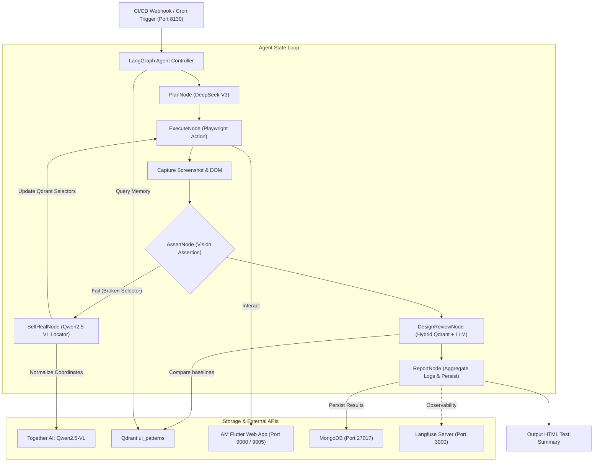
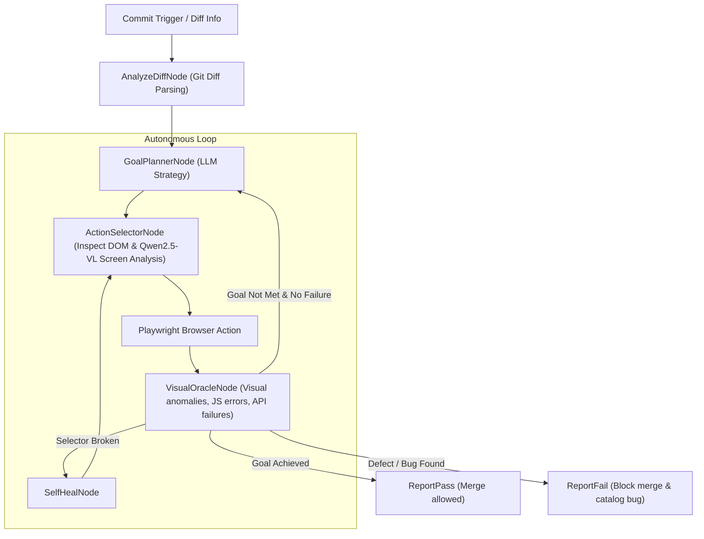

# AM UI Test Agent — Technical Design Specification

> **Role:** Technical Architect & Software Developer  
> **Status:** Finalized Design Specification | **Scope:** `am-ui-test-agent/` (New Repository)  
> **Location:** Moved to [`ui-agent-ai-testing/`](README.md) (2026-06-14)

**Companion docs:**

- [DESIGN_REVIEW_HYBRID.md](DESIGN_REVIEW_HYBRID.md) — cost-effective hybrid design validation (Qdrant + LLM on drift)
- [OPERATIONS_WEEKLY_UI_RELEASE.md](OPERATIONS_WEEKLY_UI_RELEASE.md) — weekly seed / compare / promote runbook
- [IMPLEMENTATION_STATUS.md](IMPLEMENTATION_STATUS.md) — built vs planned

This specification defines the complete technical design, module-level interfaces, state machine definitions, vector database collections, and integration protocols for the autonomous visual UI testing agent (`am-ui-test-agent`).

---

## 1. System Context & Workflow

The `am-ui-test-agent` is an autonomous execution service that runs visual, behavioral, and self-healing tests against the AM Flutter Web App. It operates as a LangGraph agent workflow using Playwright for browser interactions, Qwen2.5-VL (via Together AI) for visual element detection, and Qdrant for semantic selectors and state memory.

> **Implementation note:** Auth profile (`AUTH_FLOW_MAIN`) today uses fixed Playwright steps and text/URL asserts. Full vision assertion and `design_review` node are specified in [DESIGN_REVIEW_HYBRID.md](DESIGN_REVIEW_HYBRID.md).



### Protocol & Port Registry
| Component | Port | Interface Protocol | Namespace / Location | Authentication |
|---|---|---|---|---|
| `am-ui-test-agent` | `8130` | HTTP / JSON | `am-apps-preprod` | Keycloak JWT Bearer / CI Token |
| `Qdrant` | `6333` | HTTP / gRPC | `am-ai` (Self-hosted) | API Token |
| `MongoDB` | `27017` | MongoDB Wire | `am-infra` (Test Reports DB) | Password Authenticated |
| `Together AI API` | External | HTTPS REST | `https://api.together.xyz` | API Key |

---

## 2. Directory & File Structure

The agent is located in its own repository `a:/InfraCode/AM-Portfolio-grp/am-ui-test-agent/`. The scaffolded file layout is as follows:

```
am-ui-test-agent/
├── requirements.txt            # System dependencies (playwright, langgraph, qdrant-client, motor)
├── pyproject.toml              # Formatting and linting configuration
├── Dockerfile                  # Production-ready image with Chrome/Playwright drivers preinstalled
├── Makefile                    # Local commands to run and test the agent
├── app/
│   ├── __init__.py
│   ├── main.py                 # FastAPI runner, mounts routes, and sets cron timers
│   ├── config.py               # Pydantic base configuration
│   ├── browser/
│   │   ├── __init__.py
│   │   ├── controller.py       # Playwright browser lifecycle wrapper (headed/headless modes)
│   │   ├── dom.py              # Interactive DOM component tree extractor
│   │   └── screenshot.py       # Captures, crops, and base64 encodes screen views
│   ├── vision/
│   │   ├── __init__.py
│   │   ├── analyzer.py         # Connects to Qwen2.5-VL API for screenshot analytics
│   │   └── coordinate.py       # Translates normalized bounding boxes (0-1000) to pixel points
│   ├── memory/
│   │   ├── __init__.py
│   │   ├── qdrant.py           # Collection manager and client wrapper for Qdrant
│   │   └── embedder.py         # Computes text (DeepSeek) and image (CLIP) embeddings
│   ├── agent/
│   │   ├── __init__.py
│   │   ├── state.py            # TypedDict defining LangGraph state properties
│   │   ├── graph.py            # LangGraph pipeline compilation (nodes & conditional edges)
│   │   ├── planner.py          # Spec parsing node (spec -> step list)
│   │   ├── executor.py         # Step executor node
│   │   ├── design_review.py    # Hybrid Qdrant baseline + LLM on drift (see DESIGN_REVIEW_HYBRID.md)
│   │   ├── self_healer.py      # Self-healing engine for repairing broken element selectors
│   │   └── reporter.py         # Aggregates results into final summary formats
│   ├── api/
│   │   ├── __init__.py
│   │   ├── test_runner.py      # Endpoint to trigger runs: POST /api/v1/test/run
│   │   ├── design_baselines.py # POST /api/v1/design/baseline/promote
│   │   └── report_viewer.py    # Endpoint to view historic runs and screenshot diffs
│   └── scheduler/
│       ├── __init__.py
│       └── cron.py             # Nightly regression cron runner (runs at 2:00 AM)
└── tests/
    ├── conftest.py
    ├── test_browser.py         # Tests Playwright actions & Keycloak Login
    ├── test_vision.py          # Mocks Qwen2.5-VL and validates bounding box conversion
    └── test_agent_graph.py     # Validates node state transitions
```

Platform documentation: `am-platform/docs/ui-agent-ai-testing/`

---

## 3. LangGraph Agent State Machine

The core executor runs as a state machine using LangGraph. It manages the following state schema throughout the lifecycle:

* **File:** `app/agent/state.py`
```python
from typing import TypedDict, List, Dict, Any, Optional

class AgentState(TypedDict):
    target_url: str                      # Starting URL of the Flutter Web application
    specification: str                   # Text description of the desired behavior (Gherkin style)
    steps: List[str]                     # Synthesized sequence of steps to perform
    current_step_index: int              # Pointer to the current step being executed
    selectors_db: Dict[str, str]         # Map of element name -> selector resolved from Qdrant
    failures_encountered: List[Dict[str, Any]] # Collection of assertions/actions that failed
    screenshot_history: List[str]        # Base64-encoded screenshots captured after each step
    report_output: Optional[str]         # Path to final compiled HTML report
    mongodb_report_id: Optional[str]     # Key mapping to the persisted run in MongoDB
```

### State Node Responsibilities
1. **PlanNode (`Planner`)**: Reads Gherkin text and compiles an ordered list of tasks (e.g. `Click 'Sign In'`, `Type 'test@am.org' in email field`).
2. **ExecuteNode (`Executor`)**: Retrieves selector from Qdrant. Performs the actions on Playwright.
3. **AssertNode (`Assertion Check`)**: Compares screenshots against baseline images or checks for the presence of target elements to verify visual regression.
4. **DesignReviewNode (`Design Review`)**: Hybrid Qdrant similarity + vision LLM on drift. See [DESIGN_REVIEW_HYBRID.md](DESIGN_REVIEW_HYBRID.md).
5. **SelfHealNode (`Self-Healer`)**: Triggers when Playwright fails to find a selector. Uses Qwen2.5-VL to locate the button/field on the screenshot, calculates coordinates, executes the click, and updates the selectors database in Qdrant.
6. **ReportNode (`Reporter`)**: Generates an HTML report, saves artifacts to MongoDB, and signals completion.

---

## 4. Playwright & Computer Vision Integration

### 4.1 Vision Model Bounding Box Conversion
When an element cannot be matched via CSS/XPath selectors, the agent queries the `Qwen/Qwen2.5-VL-7B-Instruct` model hosted on Together AI.

* **Vision API Request Spec:**
```json
{
  "model": "Qwen/Qwen2.5-VL-7B-Instruct",
  "messages": [
    {
      "role": "user",
      "content": [
        {
          "type": "text",
          "text": "Find the element labeled 'Allocate Portfolio' and provide its bounding box [ymin, xmin, ymax, xmax] normalized to 0-1000."
        },
        {
          "type": "image_url",
          "image_url": {
            "url": "data:image/png;base64,iVBORw0KG..."
          }
        }
      ]
    }
  ]
}
```

* **Coordinate Translation Algorithm:**
Qwen2.5-VL outputs a bounding box in normalized format `[ymin, xmin, ymax, xmax]` range `[0, 1000]`.
```python
def translate_normalized_box(box: List[int], viewport_width: int, viewport_height: int) -> Dict[str, int]:
    """Translates normalized 0-1000 box from Qwen2.5-VL to actual screen pixel coordinates."""
    ymin, xmin, ymax, xmax = box
    
    # Map back to viewport size
    pixel_xmin = int((xmin / 1000.0) * viewport_width)
    pixel_xmax = int((xmax / 1000.0) * viewport_width)
    pixel_ymin = int((ymin / 1000.0) * viewport_height)
    pixel_ymax = int((ymax / 1000.0) * viewport_height)
    
    # Return center point for Playwright to execute the click action
    center_x = (pixel_xmin + pixel_xmax) // 2
    center_y = (pixel_ymin + pixel_ymax) // 2
    
    return {"x": center_x, "y": center_y}
```
Playwright then performs `page.mouse.click(center_x, center_y)` to interact with the element.

---

## 5. Qdrant Memory Collections

Four separate collections are maintained in Qdrant to store state patterns, locator logs, historic test data, and UI patterns.

| Collection Name | Dimension | Metric | Payload Details |
|---|---|---|---|
| `ui_patterns` | `512` | Cosine | CLIP image embeddings of interface components mapped to specific page routes. |
| `test_cases` | `1536` | Cosine | Text embeddings (DeepSeek) of Gherkin specs and past execution outputs. |
| `selectors` | `1536` | Cosine | Map of logical names (e.g. `login_submit_btn`) to HTML selectors and coordinates. |
| `bug_memory` | `512` | Cosine | Mapped visual screenshots of glitches, crashes, and CSS layout breakages. |

Baseline lifecycle (`seed` / `compare` / `promote`) applies to **`ui_patterns`** only. Details: [DESIGN_REVIEW_HYBRID.md](DESIGN_REVIEW_HYBRID.md).

---

## 6. API & Scheduling Interface

### 6.1 Trigger Test Execution
* **Path:** `POST /api/v1/test/run`
* **Headers:**
  ```http
  Authorization: Bearer <Keycloak_JWT>
  Content-Type: application/json
  ```
* **Request Body:**
  ```json
  {
    "targetUrl": "http://localhost:9005",
    "specification": "Feature: Portfolio Table Sorting\n  Scenario: Sort by valuation\n    Given I am logged in\n    When I click the 'Valuation' header\n    Then the table should sort in descending order",
    "headless": true
  }
  ```
* **Response:**
  ```json
  {
    "testId": "60c72b2f9b1d8a0015f8ba32",
    "status": "RUNNING",
    "message": "LangGraph state machine initialized and running."
  }
  ```

### 6.2 Auth flow (implemented)

* **Path:** `POST /api/v1/test/run/auth`
* **Body:** `{ "targetUrl", "uiMode", "baselineMode" }` — see [OPERATIONS_WEEKLY_UI_RELEASE.md](OPERATIONS_WEEKLY_UI_RELEASE.md)

### 6.3 Nightly Cron Orchestrator
A background task scheduler runs inside FastAPI using `APScheduler`. At **2:00 AM** daily, the scheduler fetches active test suites from MongoDB, requests a Bearer token via client credentials grant (`AM_MCP_CLIENT_ID` / `AM_MCP_CLIENT_SECRET`) from Keycloak, and initiates headless regressions against staging.
* Reports are outputted to `/var/www/reports/` and an alert is published to Keycloak/Slack if failures exceed 0.

---

## 7. CI/CD Integration & Pre-Release Gating

To prevent regressions from reaching production, the test agent integrates directly into the commit lifecycle of the [am-modern-ui](file:///a:/InfraCode/AM-Portfolio-grp/am-modern-ui) codebase.

```mermaid
sequenceDiagram
    autonumber
    actor Dev as Developer
    participant UI as am-modern-ui Repo
    participant CI as GitHub Actions CI
    participant Agent as am-ui-test-agent
    participant App as Staging App (Port 9005)

    Dev->>UI: git push commit / open PR
    UI->>CI: Trigger CI Workflow
    CI->>CI: Build & Deploy UI to Preprod Preview
    CI->>Agent: POST /api/v1/test/run {"profile": "RELEASE_GATE", "commitSha": "abc1234"}
    
    rect rgb(20, 20, 30)
        note right of Agent: LangGraph Run: RELEASE_GATE Suite
        Agent->>App: Launch Playwright & Execute Major Flows
        App-->>Agent: Output responses & screenshots
        Agent->>Agent: Assertions check (and Self-Heal if needed)
    end
    
    Agent-->>CI: Callback POST (status: success/failed, reportUrl)
    alt Pass
        CI->>Dev: green_heart PR Check Passed / Proceed to Release
    else Fail
        CI->>Dev: red_circle PR Check Failed / Block Release
    end
```



### 7.1 Release-Blocking Critical Flows (Release Gates)
When the `profile` parameter is set to `RELEASE_GATE`, the agent dynamically fetches and executes only the critical business paths. A single failure in any of these flows will block the build/deployment pipeline:

1. **Authentication Loop**: Keycloak SSO redirect, MFA token handshake, session preservation, and logout.
2. **Portfolio Dashboard Integrity**: Valuation loading check (p50 < 800ms), holdings table rendering, and asset allocation pie chart SVG verification.
3. **Trade Execution Cycle**: Opening trade ticket widget, inputting mock buy/sell actions, checking slippage calculations, executing transaction, and verifying update in trade history table.
4. **Document Upload Pipeline**: Navigating to document ingestion, uploading PDF files, checking status polling, and asserting that parsed database data reflects the visual summary.

### 7.2 Webhook Schema Enhancement
* **Path:** `POST /api/v1/test/run`
* **Request Payload:**
```json
{
  "targetUrl": "https://preprod.am.munish.org/portfolio",
  "profile": "RELEASE_GATE",
  "commitSha": "a1b2c3d4e5f6g7h8",
  "branch": "main",
  "callbackUrl": "https://github.com/api/v3/repos/AM-Portfolio-grp/am-modern-ui/statuses/a1b2c3d4e5f6g7h8"
}
```

### 7.3 CI Pipeline Definition (`am-modern-ui`)
A standard pipeline file [ui-test-gate.yml](file:///a:/InfraCode/AM-Portfolio-grp/am-modern-ui/.github/workflows/ui-test-gate.yml) is run on every Pull Request targetting `main` or `release/*` branches.

```yaml
name: Pre-Release Gate UI Test

on:
  pull_request:
    branches:
      - main
      - 'release/*'

jobs:
  ui-visual-test:
    runs-on: ubuntu-latest
    steps:
      - name: Checkout Code
        uses: actions/checkout@v4

      - name: Deploy Preview Environment
        run: |
          # Command to deploy branch to preprod-preview namespace...
          echo "Deploying to preview environment..."

      - name: Trigger Agent Release Gate
        id: trigger_agent
        run: |
          RESPONSE=$(curl -s -X POST "http://am-ui-test-agent.am-apps-preprod.svc.cluster.local:8130/api/v1/test/run" \
            -H "Content-Type: application/json" \
            -d '{
              "targetUrl": "http://am-portfolio-preview-${{ github.event.pull_request.head.sha }}:9005",
              "profile": "RELEASE_GATE",
              "commitSha": "${{ github.event.pull_request.head.sha }}",
              "callbackUrl": "https://api.github.com/repos/${{ github.repository }}/statuses/${{ github.event.pull_request.head.sha }}"
            }')
          echo "TEST_ID=$(echo $RESPONSE | jq -r .testId)" >> $GITHUB_ENV

      - name: Poll Test Status
        run: |
          # Loop to poll GET /api/v1/test/status/$TEST_ID until completed.
          # Returns non-zero exit code if status is FAILED.
          python scripts/poll_test_status.py --test-id ${{ env.TEST_ID }}
```

> [!WARNING]
> **No Direct Bypasses**: The release branch protection rules in GitHub must require the status context `ui-visual-test` to be green before pull requests can be merged.

Weekly UI baseline promotion on `main`: [OPERATIONS_WEEKLY_UI_RELEASE.md](OPERATIONS_WEEKLY_UI_RELEASE.md).

---

## 8. Fully Autonomous Exploratory & Goal-Driven Mode

In addition to executing Gherkin scripts, the agent operates in a **Fully Autonomous mode** where it acts as a self-directed QA engineer. Instead of step-by-step instructions, the agent accepts high-level testing goals and code diffs, exploring the UI dynamically to find bugs.



> **Cost note:** VisualOracle runs vision on every step — suitable for exploratory mode, not daily auth CI. Use [DESIGN_REVIEW_HYBRID.md](DESIGN_REVIEW_HYBRID.md) for cost-effective release gating.

### 8.1 Git Diff Analyzer & Target Routing
When a commit is pushed, the webhook payload includes the Git patch or diff. The `AnalyzeDiffNode` extracts filenames and changes to target its exploration:

```python
class DiffAnalyzer:
    def identify_changed_targets(self, git_diff: str) -> List[str]:
        """Parses git diff to map modified code components to UI screens.
        
        Example:
          - Modifying 'allocation_pie.dart' maps to target route '/portfolio/allocation'
          - Modifying 'auth_service.dart' maps to target route '/login'
        """
        # Parses file names and returns prioritized list of route targets
        pass
```

### 8.2 The Autonomous Loop & Visual Oracle
The agent maintains a state memory of visited pages, interactive elements clicked, and inputs entered. At each step, the `VisualOracleNode` runs the following automated checks:

* **Visual Anomaly Detection**: Qwen2.5-VL reviews the screenshot to detect overlapping texts, clipped elements, alignment glitches, or unrendered charts.
* **Functional Error Detection**: The agent intercepts Playwright console messages and network logs to catch `500 Internal Server Errors`, uncaught JavaScript exceptions, or Keycloak handshake failures.
* **Goal State Evaluation**: The agent compares the current screen state against the high-level goal (e.g. *"Ensure that allocating 100% funds to cash is successfully registered and shows on the pie chart"*).

### 8.3 State Schema Extensions for Autonomy
To support exploratory state tracking, the `AgentState` schema in [state.py](file:///a:/InfraCode/AM-Portfolio-grp/am-ui-test-agent/app/agent/state.py) is extended:

```python
class AutonomousAgentState(AgentState):
    testing_goal: str                    # High-level goal (e.g., "Verify allocation table sorts by custom field")
    git_diff: Optional[str]              # Unified diff patch of the current commit
    visited_routes: List[str]            # Visited path names to prevent circular navigation loops
    action_log: List[Dict[str, Any]]     # Sequential record of exploratory clicks, scrolls, and typings
    visual_anomalies: List[str]          # Anomalies identified by Qwen2.5-VL
    design_review_results: List[Dict[str, Any]]  # Per-screenshot hybrid review (planned)
    design_review_summary: Dict[str, Any]        # overall_verdict, review_required (planned)
```

---

## 9. Helm & HashiCorp Vault Configuration

The `am-ui-test-agent` is packaged as a Helm chart and loads credentials via HashiCorp Vault.

### 9.1 Vault Secret Mappings (`helm/vault-mappings.yaml`)
Securely binds environment configurations:
```yaml
vault:
  secretPaths:
    mongodb:
      mappings:
        MONGO_URI: "url"
    qdrant:
      mappings:
        QDRANT_API_KEY: "QDRANT_API_KEY"
    together-ai:
      mappings:
        TOGETHER_API_KEY: "TOGETHER_API_KEY"
    identity-oidc:
      mappings:
        AM_MCP_CLIENT_SECRET: "AM_MCP_CLIENT_SECRET"
```

### 9.2 Helm Values & Ingress (`helm/values.yaml`)
Exposes test-triggering endpoints through Traefik Ingress:
```yaml
global:
  vault:
    enabled: true
    role: "am-backend-role"
    authPath: "auth/kubernetes"
    serviceAccountName: "am-backend-sa"

image:
  repository: am-ui-test-agent

replicaCount: 1
port: 8130

service:
  port: 8130

ingress:
  enabled: true
  className: "traefik"
  annotations:
    kubernetes.io/ingress.class: "traefik"
    traefik.ingress.kubernetes.io/router.entrypoints: web,websecure
    traefik.ingress.kubernetes.io/router.middlewares: >-
      am-apps-preprod-global-cors@kubernetescrd,
      am-apps-preprod-strip-prefix-apps@kubernetescrd
  hosts:
    - host: am.asrax.in
      paths:
        - path: /ui-test
          pathType: Prefix
```
