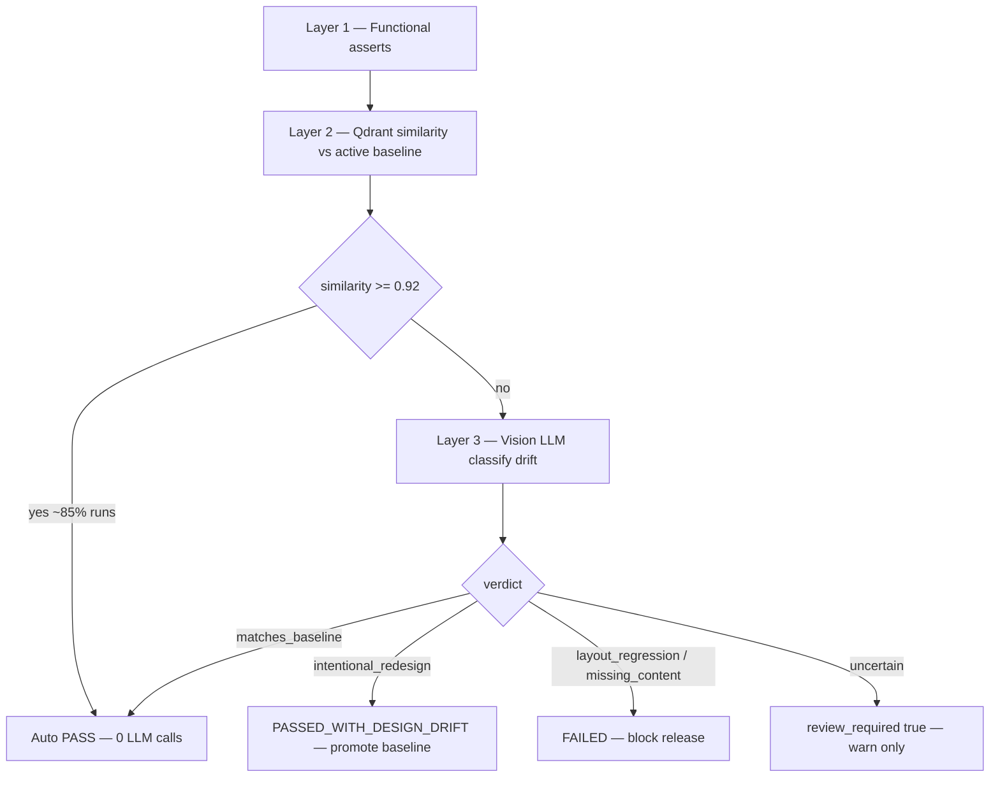

# Hybrid Design Review — Qdrant Baselines + Vision LLM on Drift

> **Status:** Specification (implementation planned)  
> **Scope:** `am-ui-test-agent` design_review node, Qdrant `ui_patterns`, report schema  
> **Audience:** Platform engineers, QA, release owners

---

## 1. Problem

The auth E2E flow today validates **behavior only**:

| Step | Mechanism |
|------|-----------|
| Plan | Fixed 10 steps from `AUTH_FLOW_MAIN` profile — not LLM-generated |
| Execute | Playwright: navigate, Demo Login, screenshots |
| Assert | Code checks URL `/home`, text `Dashboard`, `Portfolio` |
| Report | Template from `action_log` — no LLM narrative |
| Self-heal | Skipped for auth/demo-login flows |
| Qdrant | Client exists; **not used** in the agent graph |

A UI can **pass all text asserts** while layout is broken, or **fail visually** on every weekly redesign if we only use pixel diff without a promote workflow.

**Goal:** Auto-validate design/production readiness at scale. Manual review only when `design_review.review_required === true`.

---

## 2. Hybrid approach (definition)

**Hybrid** combines three layers. Layers 1–2 are cheap; layer 3 runs **only when layer 2 detects change**.



| Layer | Question | Cost |
|-------|----------|------|
| **1 — Functional** | Does the app still work? | Playwright only (existing) |
| **2 — Similarity** | Does it look like last **approved** design? | Local embed + Qdrant search (self-hosted, ~free) |
| **3 — Vision LLM** | Is the difference a redesign or a bug? | Qwen2.5-VL via LiteLLM — **only on drift** |

### Why not the alternatives?

| Approach | Weekly UI releases | Cost | Verdict |
|----------|-------------------|------|---------|
| LLM checklist every screenshot | OK | **High** (~4 vision calls × every run) | Rejected for CI volume |
| Qdrant / golden screenshots only | **Fails every release** until manual baseline swap | Low | Incomplete alone |
| **Hybrid (chosen)** | **Good** — promote updates baseline | **Low** (~4 calls per release + rare regressions) | **Recommended** |

---

## 3. What “correct design” means

**Golden screenshots** stored in Qdrant collection `ui_patterns`, keyed by:

| Payload field | Example |
|---------------|---------|
| `profile` | `AUTH_FLOW_MAIN` |
| `route` | `/home` |
| `step_label` | `10. Screenshot — authenticated main shell` |
| `design_version` | `4` (monotonic) |
| `status` | `active` \| `superseded` |
| `screenshot_ref` | Path under `REPORT_DIR/baselines/` |
| `commit_sha` | Git SHA when baseline was promoted |
| `approved_at` | ISO timestamp |

Vector: **512-dimensional** cosine similarity (design doc §5). Implementation uses a **local hash embedder** by default (no API cost); optional LiteLLM CLIP model in preprod/prod.

Only **one active baseline** per `(profile, route, step_label)`. Older versions remain as `superseded` for audit.

---

## 4. Baseline modes

| Mode | When | Behavior |
|------|------|----------|
| **`seed`** | First-time setup; empty Qdrant | After functional PASS, upsert first baselines. No design fail. |
| **`compare`** | PR checks, nightly, daily CI | Compare to active baseline; LLM only if similarity below threshold. |
| **`promote`** | UI merged to `main` (weekly release) | Functional PASS + LLM `intentional_redesign` → supersede old baseline, upsert new. |

### API (planned)

```http
POST /api/v1/test/run/auth
Content-Type: application/json

{
  "targetUrl": "https://am.asrax.in",
  "uiMode": "main",
  "baselineMode": "compare"
}
```

```http
POST /api/v1/design/baseline/promote
Content-Type: application/json

{
  "testId": "44dc0244-8480-4f47-b985-aab6fa576d8c",
  "stepLabels": ["10. Screenshot — authenticated main shell"]
}
```

CLI:

```powershell
python scripts/run_auth_test.py --target-file ../am-modern-ui/testing/targets.preprod.json --baseline-mode seed
python scripts/run_auth_test.py --baseline-mode promote
```

---

## 5. Balanced release gate

**Locked decision:** Balanced — not strict, not loose.

| Condition | Test status | Blocks merge? |
|-----------|-------------|---------------|
| Functional assert fails | `FAILED` | **Yes** |
| LLM: `layout_regression` or `missing_content` | `FAILED` | **Yes** |
| LLM: `intentional_redesign` (functional pass) | `PASSED_WITH_DESIGN_DRIFT` | **No** (warn until promote completes) |
| LLM: `uncertain` | `PASSED` or drift warn | **No** — `review_required: true` |
| Similarity ≥ 0.92 or LLM `matches_baseline` | `PASSED` | **No** |

`DESIGN_GATE_STRICT=true` (optional env) would fail on any drift before promote — **not recommended** for weekly UI releases.

### Config (planned)

```python
DESIGN_REVIEW_ENABLED: bool = True
DESIGN_SIMILARITY_PASS: float = 0.92      # auto-pass, no LLM
DESIGN_SIMILARITY_REVIEW: float = 0.78    # always invoke LLM below this
DESIGN_GATE_STRICT: bool = False
DESIGN_BUG_MEMORY_THRESHOLD: float = 0.95 # optional fast-fail vs bug_memory
BASELINE_MODE: Literal["compare", "seed", "promote"] = "compare"
CLIP_EMBEDDING_MODEL: Optional[str] = None  # unset = local embedder
```

---

## 6. LangGraph integration

Current graph:

```text
plan → execute → assert → report
```

Target graph:

```text
plan → execute → assert → design_review → report
```

Skip `design_review` when:

- `DESIGN_REVIEW_ENABLED=false`
- Qdrant unreachable (degrade to today’s behavior)
- Functional failures already recorded (go straight to report)

New state fields:

```python
design_review_results: List[Dict[str, Any]]
design_review_summary: Dict[str, Any]   # overall_verdict, review_required, etc.
visual_anomalies: List[str]             # populated from design + bug_memory
```

Vision LLM prompt returns structured JSON:

```json
{
  "verdict": "matches_baseline | intentional_redesign | layout_regression | missing_content | uncertain",
  "confidence": 0.91,
  "summary": "Nav and dashboard regions intact; color palette shifted.",
  "issues": []
}
```

Functional checklist passed into prompt: e.g. `Dashboard`, `Portfolio` visible, URL contains `/home`.

---

## 7. Report schema extension

Schema: `am-ui-test-report/v1`

```json
{
  "schema": "am-ui-test-report/v1",
  "status": "PASSED",
  "design_review": {
    "enabled": true,
    "auto_reviewed": true,
    "review_required": false,
    "overall_verdict": "pass",
    "baseline_mode": "compare",
    "screenshots": [
      {
        "step_label": "10. Screenshot — authenticated main shell",
        "route": "/home",
        "similarity": 0.94,
        "verdict": "matches_baseline",
        "llm_summary": "Layout consistent with baseline v4.",
        "baseline_design_version": 4,
        "llm_called": false
      }
    ]
  }
}
```

**Manual review policy:** Open HTML/JSON only when `design_review.review_required === true`.

HTML adds a **Design Review** section:

- Green auto-pass card when all screenshots pass similarity.
- Side-by-side baseline vs current thumbnail when drift detected.
- LLM summary + verdict badge.

---

## 8. Cost model (weekly UI releases)

Auth flow captures **~4 screenshots** per run.

| Strategy | LLM calls / week (1 release + 6 stable days) |
|----------|-----------------------------------------------|
| Vision on every screenshot, daily | 7 × 4 = **28+** |
| **Hybrid** | ~4 on promote day + 0–4 if regression ≈ **4–8** |

Between releases, stable UI → **0 LLM calls** per run.

Qdrant + local embedding → negligible marginal cost (cluster `am-ai`, port 6333).

---

## 9. Qdrant collections (design doc alignment)

| Collection | Dim | Hybrid usage |
|------------|-----|--------------|
| **`ui_patterns`** | 512 | **Primary** — golden screenshots per route/step |
| **`bug_memory`** | 512 | Phase 2 — high similarity to known glitch → fail without LLM |
| **`selectors`** | 1536 | Self-heal only (auth skips today) |
| **`test_cases`** | 1536 | Autonomous / Gherkin mode (future) |

---

## 10. CI / branch policy

| Branch / event | `baselineMode` | May update Qdrant? |
|----------------|----------------|--------------------|
| PR → `main` | `compare` | **No** |
| Push / merge to `main` (weekly UI) | `promote` | **Yes** |
| Nightly cron | `compare` | **No** |
| One-time setup | `seed` | **Yes** |

PRs **compare** against production baselines on `main` — they must not overwrite golden screenshots. Only the post-merge promote job on `main` advances `design_version`.

Example GitHub Actions (after UI merge):

```yaml
- name: Promote design baselines
  if: github.ref == 'refs/heads/main'
  run: |
    cd am-modern-ui && npm run test:auth:preprod -- --baseline-mode=promote
```

---

## 11. Implementation phases

| Phase | Deliverable | Status |
|-------|-------------|--------|
| P0 | Auth flow + template reports | **Done** |
| P1 | `embedder.py`, Qdrant `ui_patterns` CRUD, `design_review` node, report fields | Planned |
| P2 | `baselineMode` on API/CLI, promote endpoint, CI on `main` | Planned |
| P3 | Gateway MCP `promote_design_baseline`, `bug_memory` fast-fail | Planned |

See [IMPLEMENTATION_STATUS.md](IMPLEMENTATION_STATUS.md) for file-level checklist.

---

## 12. References

- [AM_UI_TEST_AGENT_DESIGN.md](AM_UI_TEST_AGENT_DESIGN.md) — AssertNode baseline comparison, Qdrant §5, VisualOracle §8
- [OPERATIONS_WEEKLY_UI_RELEASE.md](OPERATIONS_WEEKLY_UI_RELEASE.md) — step-by-step runbook
- Code: `am-ui-test-agent/app/agent/graph.py`, `app/memory/qdrant.py`, `app/profiles/modern_ui/auth_flow.py`
- Reports: `AM-Portfolio-grp/reports/ui-test/{testId}.json`
