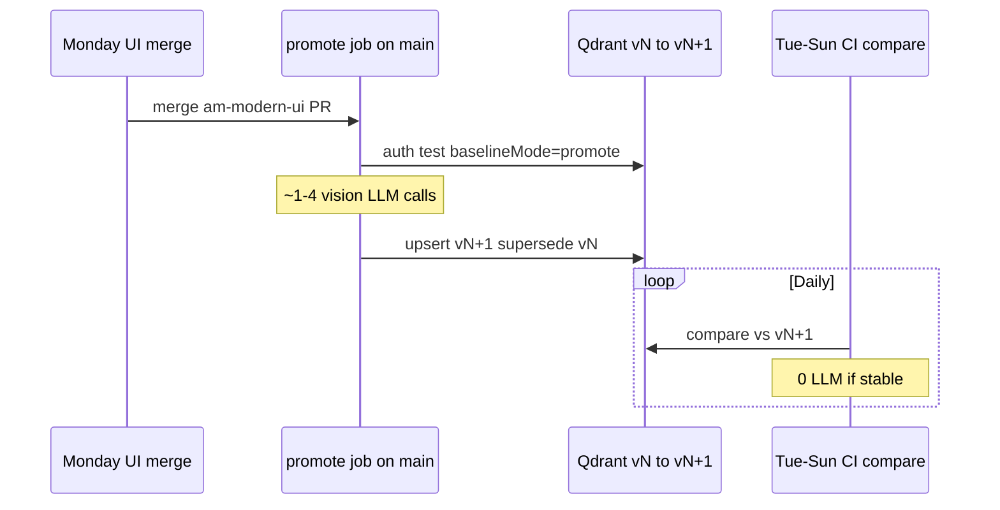

# Operations Runbook — Weekly UI Release (Hybrid Design Review)

> **Prerequisite:** [DESIGN_REVIEW_HYBRID.md](DESIGN_REVIEW_HYBRID.md)  
> **Cadence:** UI changes ship to production approximately **once per week**

---

## 1. Overview

Each weekly UI release follows a **three-mode baseline lifecycle**:

```text
seed (once)  →  compare (daily / PR)  →  promote (on main after merge)
```

You should **not** read every test report. Only open reports where:

```json
"design_review": { "review_required": true }
```

---

## 2. One-time setup (seed)

Run once per environment (`preprod`, then `prod` when ready) after Qdrant is reachable.

### Local

```powershell
# Terminal 1 — agent
cd am-ui-test-agent
npm run preprod

# Terminal 2 — seed baselines from known-good auth run
cd am-ui-test-agent
python scripts/run_auth_test.py `
  --target-file ../am-modern-ui/testing/targets.preprod.json `
  --target main `
  --baseline-mode seed `
  --open-report
```

### API

```http
POST http://localhost:8130/api/v1/test/run/auth
Content-Type: application/json

{
  "targetUrl": "https://am.asrax.in",
  "uiMode": "main",
  "baselineMode": "seed"
}
```

**Expected outcome:**

- Functional status: `PASSED`
- Qdrant `ui_patterns`: 3–4 new points with `status=active`, `design_version=1`
- Report: `design_review.overall_verdict = pass`, baselines seeded message
- **No LLM calls** (seed mode skips design fail)

Verify Qdrant (optional):

```bash
curl http://qdrant.am-ai.svc.cluster.local:6333/collections/ui_patterns
```

---

## 3. Weekly release workflow

### Timeline



### Step 1 — PR phase (`compare`)

While the UI PR is open, CI runs auth tests with **`baselineMode=compare`** (default).

| Result | Meaning | Action |
|--------|---------|--------|
| `PASSED`, similarity high | No visual drift vs current production baseline | None |
| `PASSED_WITH_DESIGN_DRIFT` | PR changes pixels; LLM says redesign | **Expected** on UI PRs — does not block merge in balanced mode |
| `FAILED` functional | Broken flow | Fix before merge |
| `FAILED` + `layout_regression` | Broken layout | Fix before merge |
| `review_required: true` | LLM uncertain | Human skim **this PR’s report only** |

PRs **must not** run `promote` — they compare against `main` baselines without overwriting them.

### Step 2 — Merge to `main`

After merge, run **promote** exactly once (CI job or manual):

```powershell
cd am-modern-ui
npm run test:auth:preprod -- --baseline-mode=promote
```

Or via agent API:

```http
POST /api/v1/test/run/auth
{ "uiMode": "main", "baselineMode": "promote" }
```

**What promote does:**

1. Runs full auth flow (10 steps).
2. Requires functional PASS.
3. Compares screenshots to **previous week’s** active baselines → low similarity (expected).
4. Calls vision LLM (~1–4 times) → expects `intentional_redesign`.
5. Supersedes old baselines; upserts new `design_version`.
6. Status: `PASSED` or `PASSED_WITH_DESIGN_DRIFT`.

**Your weekly checklist (5 minutes):**

- [ ] Promote job green on `main`
- [ ] If `review_required: true`, open **one** report and confirm redesign is intentional
- [ ] Done — ignore other reports until next incident

### Step 3 — Rest of week (`compare`)

Nightly cron and ad-hoc runs use **`compare`** only.

- Stable UI → auto-pass, **0 LLM**
- Accidental layout break → `layout_regression` → **FAILED** → fix + redeploy

---

## 4. Mid-week hotfix (UI pixels change again)

If a hotfix changes visuals before the next scheduled release:

```powershell
npm run test:auth:preprod -- --baseline-mode=promote
```

Same as weekly promote. Increments `design_version` again.

---

## 5. Manual promote from a specific report

When automated promote fails but you approve the screenshots manually:

```http
POST /api/v1/design/baseline/promote
Content-Type: application/json

{
  "testId": "44dc0244-8480-4f47-b985-aab6fa576d8c",
  "stepLabels": [
    "3. Screenshot — login form visible",
    "10. Screenshot — authenticated main shell"
  ]
}
```

(Optional — planned MCP tool: `promote_design_baseline` on gateway.)

---

## 6. Environment matrix

| Environment | Target URL source | Seed when | Promote when |
|-------------|-------------------|-----------|--------------|
| Local | `targets.local.json` | Dev setup | Rarely |
| Preprod | `targets.preprod.json` → `https://am.asrax.in` | First Qdrant connect | Weekly `main` merge |
| Prod | TBD targets.prod.json | Before prod gate enabled | Prod release tag |

Reports path: `AM-Portfolio-grp/reports/ui-test/` (local) or PVC in cluster.

---

## 7. Troubleshooting

| Symptom | Likely cause | Fix |
|---------|--------------|-----|
| Every run `PASSED_WITH_DESIGN_DRIFT` | Promote not run after last UI merge | Run `promote` on `main` |
| Design review skipped | Qdrant down or `DESIGN_REVIEW_ENABLED=false` | Check agent logs; restore Qdrant |
| LLM on every run | Baselines missing; similarity always low | Re-run `seed` or `promote` |
| PR fails design but UI intentional | Strict gate or missing promote on main | Use balanced gate; promote after merge |
| False `layout_regression` | LLM noise | Tune thresholds; flag `uncertain` for human |

---

## 8. CI templates (planned)

### PR — compare only

```yaml
# am-modern-ui/.github/workflows/ui-test-gate.yml
- name: Auth E2E compare
  run: npm run test:auth:preprod
  # default baselineMode=compare
```

### Main — promote after merge

```yaml
on:
  push:
    branches: [main]

jobs:
  promote-design-baselines:
    runs-on: ubuntu-latest
    steps:
      - uses: actions/checkout@v4
      - name: Promote Qdrant baselines
        run: npm run test:auth:preprod -- --baseline-mode=promote
```

---

## 9. Related docs

- [DESIGN_REVIEW_HYBRID.md](DESIGN_REVIEW_HYBRID.md) — architecture and gate rules
- [IMPLEMENTATION_STATUS.md](IMPLEMENTATION_STATUS.md) — what works today vs planned CLI flags
- [README.md](README.md) — doc index
