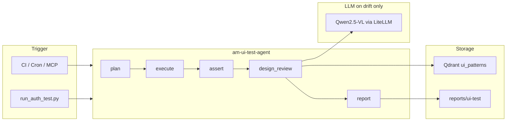

# UI Agent AI Testing

Documentation for the **AM UI Test Agent** (`am-ui-test-agent/`), MCP gateway ui-test tools, and the **Hybrid design review** pipeline (Playwright + Qdrant + vision LLM).

This folder is the canonical home for ui-agent AI testing specs. The former top-level file `AM_UI_TEST_AGENT_DESIGN.md` lives here as [`AM_UI_TEST_AGENT_DESIGN.md`](AM_UI_TEST_AGENT_DESIGN.md).

---

## Documents

| Document | Purpose |
|----------|---------|
| [AM_UI_TEST_AGENT_DESIGN.md](AM_UI_TEST_AGENT_DESIGN.md) | Full technical design: LangGraph, Playwright, Qdrant collections, CI gates, autonomous mode, Helm |
| [DESIGN_REVIEW_HYBRID.md](DESIGN_REVIEW_HYBRID.md) | **Hybrid design review** — golden baselines, similarity gate, LLM on drift, balanced release gate |
| [OPERATIONS_WEEKLY_UI_RELEASE.md](OPERATIONS_WEEKLY_UI_RELEASE.md) | Runbook for weekly UI releases: seed, compare, promote, CI wiring |
| [IMPLEMENTATION_STATUS.md](IMPLEMENTATION_STATUS.md) | What is built today vs planned (auth flow, reports, Qdrant, design_review node) |

---

## Repositories & entry points

```text
AM-Portfolio-grp/
├── am-ui-test-agent/          # Playwright + LangGraph agent (port 8130)
├── am-modern-ui/testing/      # Thin wrapper: manifest, targets, run_auth.py
├── am-platform/am-mcp-gateway/ # MCP proxy: run-auth, LiteLLM tool sync
└── reports/ui-test/           # Local HTML + JSON reports
```

| Action | Command |
|--------|---------|
| Start agent (preprod) | `cd am-ui-test-agent && npm run preprod` |
| Run auth E2E | `cd am-modern-ui && npm run test:auth:preprod` |
| View report | `reports/ui-test/{testId}.html` |

---

## Architecture (summary)



**Locked product decisions (2026-06):**

- **Gate:** Balanced — fail on functional errors + clear visual regressions; warn on intentional redesign until promote.
- **Comparison:** Hybrid — Qdrant golden screenshots + local embedding + vision LLM only when similarity drops.
- **Cadence:** Weekly UI releases — `promote` on `main` after merge; `compare` on PRs and nightly.

See [DESIGN_REVIEW_HYBRID.md](DESIGN_REVIEW_HYBRID.md) for full detail.

---

## Related platform docs

- [AM_MCP_GATEWAY_DESIGN.md](../AM_MCP_GATEWAY_DESIGN.md) — gateway OpenAPI + MCP tool proxy
- [AM_AI_PLATFORM_DESIGN.md](../AM_AI_PLATFORM_DESIGN.md) — LiteLLM, Qdrant namespace `am-ai`
